# Business Case Template

```mermaid
flowchart TD
    %% Styling definitions
    classDef title fill:#4f46e5,stroke:#312e81,stroke-width:2px,color:#fff,font-weight:bold;
    classDef section fill:#f3f4f6,stroke:#9ca3af,stroke-width:1px,color:#1f2937,font-weight:bold;
    classDef details fill:#eff6ff,stroke:#bfdbfe,stroke-width:1px,color:#1e3a8a;
    classDef financials fill:#ecfdf5,stroke:#a7f3d0,stroke-width:1px,color:#065f46;
    classDef risk fill:#fff5f5,stroke:#feb2b2,stroke-width:1px,color:#9b2c2c;

    BC([Business Case Document]):::title
    
    %% Section Layout
    BC --> G[1. General Information]:::section
    BC --> O[2. Objectives & Strategy]:::section
    BC --> S[3. Scope & Schedule]:::section
    BC --> F[4. Financials & Resources]:::section
    BC --> R[5. Risks & Impact]:::section
    BC --> A[6. Approval]:::section

    %% General Information Sub-items
    G --> G1[Name of Proposed Initiative]:::details
    G --> G2[Proposal Owner & Title]:::details
    G --> G3[Long-term Business Owner & Dept]:::details
    G --> G4[Executive Summary]:::details

    %% Objectives Sub-items
    O --> O1[Introduction & Business Objectives]:::details
    O --> O2[Strategic Alignment]:::details
    O --> O3[Value Statement]:::details
    O --> O4[Success Criteria & KPIs]:::details

    %% Scope Sub-items
    S --> S1[Deliverables List]:::details
    S --> S2[Project Scope Boundaries]:::details
    S --> S3[Other Projects & Dependencies]:::details
    S --> S4[Key Stakeholders Register]:::details
    S --> S5[Project Schedule Phases]:::details

    %% Financials Sub-items
    F --> F1[Systems & Internal Labor]:::financials
    F --> F2[Consulting & Other Costs]:::financials
    F --> F3[Recurring Costs]:::financials
    F --> F4[Systems & Data Impact]:::financials
    F --> F5[Reporting Requirements]:::financials

    %% Risks Sub-items
    R --> R1[Risk Assessment & Mitigation]:::risk
    R --> R2[Compliance & Regulatory]:::risk
    R --> R3[Training & Change Management]:::risk

    %% Approval Sub-items
    A --> A1[Authorized Signatures]:::details
```

---

## 1. General Information

- **Name of Proposed Initiative:** [Enter Initiative Name]
- **Proposal Owner:** [Enter Owner Name]
- **Title:** [Enter Title]

### Executive Summary
*Explain the key aspects of the project in a brief executive summary.*

[Enter Executive Summary here]

### Long-term Business Owner
- **Department:** [Enter Department]
- **Name:** [Enter Owner Name]

---

## 2. Introduction and Business Objectives

*Provide a summary of the reasons behind the project, including the following:*
- Background information on the business problem or opportunity
- Overview of the proposed solution or initiative
- Clearly defined goals and objectives of the project
- List of specific goals and outcomes that the project aims to achieve
- Stakeholders and their interests
- Organizational needs
- Customer requirements
- Any other factors that justify the project's existence

[Enter Introduction and Business Objectives here]

---

## 3. Deliverables

*List the tangible items or outcomes that will be produced as a result of the project.*

| Deliverable | Description / Details |
| :--- | :--- |
| | |
| | |
| | |
| | |
| | |
| | |
| | |
| | |

---

## 4. Strategic Alignment

*Explain how the project aligns with the organization's strategic priorities and contributes to its overall success.*

[Enter Strategic Alignment details here]

---

## 5. Project Scope

*Define the boundaries and limitations of the project. Include what is included and excluded from the project scope.*

[Enter Project Scope details here]

---

## 6. Value Statement

*Value may either be incurred once upon the implementation of the proposed solution or recur over the operational life of the solution. It may yield direct revenue, or strategically position the enterprise for market gains. Identify the value benefits and classify them as such.*

[Enter Value Statement here]

---

## 7. Success Criteria

*Provide details on the financial and non-financial benefits that the project is expected to generate. Additionally, outline the key performance indicators (KPIs) or metrics that will be used to measure the project's success in delivering value and achieving a positive ROI.*

*Examples (describe in specific project terms):*
- **Financial** (Cost vs. Revenue)
- **Performance**
- **User acceptance**
- **Schedule**
- **Competitive differentiation**

[Enter Success Criteria here]

---

## 8. Other Projects and Dependencies

- Have constraints and assumptions from similar past projects been reviewed and included in this proposal, with explanations for any variances?
- Have actual versus planned benefits of previous projects been compared, and have these variances been considered in the current project's benefit projections (including benefit amount, timing, and duration)?
- Are there ongoing or upcoming parallel projects that could be affected by or integrated with this project?

[Enter Other Projects and Dependencies here]

---

## 9. Key Stakeholders

*Who are the key stakeholders?*

| Name | Role | Department |
| :--- | :--- | :--- |
| | | |
| | | |
| | | |
| | | |
| | | |
| | | |

---

## 10. Project Schedule

*List the high-level phases for this project. If this Business Case scope is part of a larger program or multi-phase project, show the schedule context. Please ensure start and end dates are defined for all milestones, phases, releases of this project.*

| Phase | Dates |
| :--- | :--- |
| **Planning** | |
| **Execution** | |
| **Monitoring/Support** | |
| **Handoff/Closure** | |

---

## 11. Project Financials

*Outline the estimated budget for the project, including any resources, materials, or external services required. Specify any new recurring costs that will be required to sustain deliverables.*

| Financial Category | Estimated Cost & Details |
| :--- | :--- |
| **Systems** | |
| **Internal Labor** | |
| **Consulting** | |
| **Other** | |
| **Recurring Costs (licenses, added headcount)** | |

---

## 12. Risk Assessment and Mitigation Strategies

*Identify potential risks that could impact the success of the project and propose mitigation strategies.*

[Enter Risk Assessment and Mitigation Strategies here]

---

## 13. Compliance and Regulatory Considerations

*Identify relevant laws and regulations. Ensure compliance with legal requirements.*

[Enter Compliance and Regulatory Considerations here]

---

## 14. Training and Change Management

*Are there training and/or communication needs for users or customers handling new or modified systems, data, or reporting systems?*

[Enter Training and Change Management here]

---

## 15. Systems Impact

*Will the project require an update to or integration with an existing Canal system or the setup of a new system?*

[Enter Systems Impact here]

---

## 16. Data Impact

*Identify any potential impacts the project may have on current data structures or databases. If applicable, outline plans for data migration or integration with existing systems. Address any challenges or risks associated with data transfer.*

[Enter Data Impact here]

---

## 17. Reporting Requirements

*Identify any additional reporting requirements arising from the project. Consider the needs of various stakeholders and departments.*

[Enter Reporting Requirements here]

---

## 18. Approved By

| Approver Name | Title | Date |
| :--- | :--- | :--- |
| | | |
