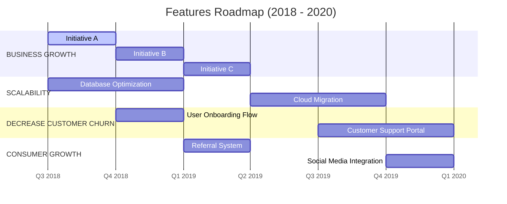

# FEATURES ROADMAP TEMPLATE

---

## FEATURES KEY
* **BUSINESS GROWTH**
* **SCALABILITY**
* **DECREASE CUSTOMER CHURN**
* **CONSUMER GROWTH**

---

## ROADMAP TIMELINE

### 2018 - Q3 (JUL, AUG, SEPT)
- **BUSINESS GROWTH:**
  - [ ] [Feature / Initiative]
- **SCALABILITY:**
  - [ ] [Feature / Initiative]
- **DECREASE CUSTOMER CHURN:**
  - [ ] [Feature / Initiative]
- **CONSUMER GROWTH:**
  - [ ] [Feature / Initiative]

### 2018 - Q4 (OCT, NOV, DEC)
- **BUSINESS GROWTH:**
  - [ ] [Feature / Initiative]
- **SCALABILITY:**
  - [ ] [Feature / Initiative]
- **DECREASE CUSTOMER CHURN:**
  - [ ] [Feature / Initiative]
- **CONSUMER GROWTH:**
  - [ ] [Feature / Initiative]

### 2019 - Q1 (JAN, FEB, MAR)
- **BUSINESS GROWTH:**
  - [ ] [Feature / Initiative]
- **SCALABILITY:**
  - [ ] [Feature / Initiative]
- **DECREASE CUSTOMER CHURN:**
  - [ ] [Feature / Initiative]
- **CONSUMER GROWTH:**
  - [ ] [Feature / Initiative]

### 2019 - Q2 (APR, MAY, JUN)
- **BUSINESS GROWTH:**
  - [ ] [Feature / Initiative]
- **SCALABILITY:**
  - [ ] [Feature / Initiative]
- **DECREASE CUSTOMER CHURN:**
  - [ ] [Feature / Initiative]
- **CONSUMER GROWTH:**
  - [ ] [Feature / Initiative]

### 2019 - Q3 (JUL, AUG, SEPT)
- **BUSINESS GROWTH:**
  - [ ] [Feature / Initiative]
- **SCALABILITY:**
  - [ ] [Feature / Initiative]
- **DECREASE CUSTOMER CHURN:**
  - [ ] [Feature / Initiative]
- **CONSUMER GROWTH:**
  - [ ] [Feature / Initiative]

### 2019 - Q4 (OCT, NOV, DEC)
- **BUSINESS GROWTH:**
  - [ ] [Feature / Initiative]
- **SCALABILITY:**
  - [ ] [Feature / Initiative]
- **DECREASE CUSTOMER CHURN:**
  - [ ] [Feature / Initiative]
- **CONSUMER GROWTH:**
  - [ ] [Feature / Initiative]

### 2020 - Q1 (JAN, FEB, MAR)
- **BUSINESS GROWTH:**
  - [ ] [Feature / Initiative]
- **SCALABILITY:**
  - [ ] [Feature / Initiative]
- **DECREASE CUSTOMER CHURN:**
  - [ ] [Feature / Initiative]
- **CONSUMER GROWTH:**
  - [ ] [Feature / Initiative]

### 2020 - Q2 (APR, MAY, JUN)
- **BUSINESS GROWTH:**
  - [ ] [Feature / Initiative]
- **SCALABILITY:**
  - [ ] [Feature / Initiative]
- **DECREASE CUSTOMER CHURN:**
  - [ ] [Feature / Initiative]
- **CONSUMER GROWTH:**
  - [ ] [Feature / Initiative]

---

[CLICK HERE TO CREATE IN SMARTSHEET](https://goo.gl/T4JJiz)

---

> [!NOTE]
> **Disclaimer:**  
> Any articles, templates, or information provided by Smartsheet on the website are for reference only. While we strive to keep the information up to date and correct, we make no representations or warranties of any kind, express or implied, about the completeness, accuracy, reliability, suitability, or availability with respect to the website or the information, articles, templates, or related graphics contained on the website. Any reliance you place on such information is therefore strictly at your own risk.
