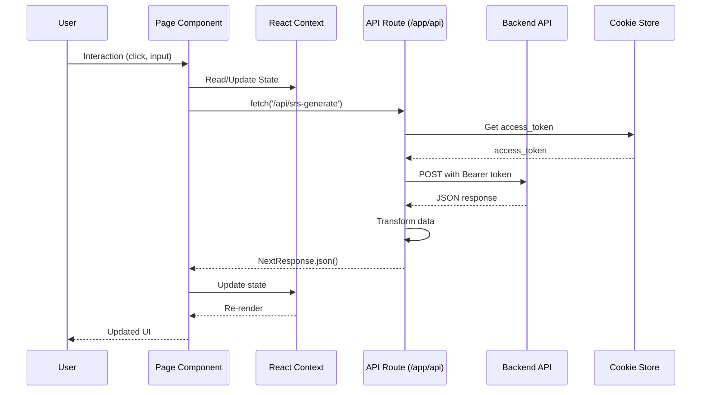
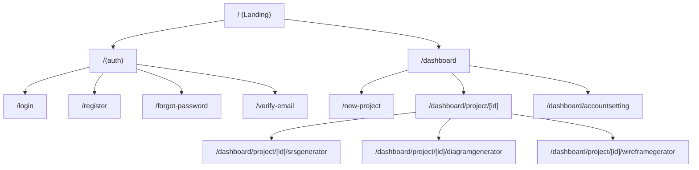

# Kiến trúc Frontend — BA Copilot

Tài liệu này mô tả kiến trúc phía frontend cho dự án BA Copilot, dựa trên cấu trúc thư mục hiện có trong repository. Mục tiêu là cung cấp mô hình thành phần, luồng dữ liệu, và khuyến nghị về quản lý trạng thái, routing, testing và triển khai.

## Tổng quan thư mục chính

### Core Application Structure

- [`app/layout.tsx`](../../app/layout.tsx) — root layout của ứng dụng (theme, global styles, providers)
- [`app/page.tsx`](../../app/page.tsx) — trang landing page/home
- [`app/globals.css`](../../app/globals.css) — global styles và CSS variables
- [`middleware.ts`](../../middleware.ts) — Next.js middleware cho authentication và route protection

### Authentication Routes

- [`app/(auth)/layout.tsx`](../../app/(auth)/layout.tsx) — layout cho nhóm route xác thực
- [`app/(auth)/login/`](../../app/(auth)/login/) — trang đăng nhập
- [`app/(auth)/register/`](../../app/(auth)/register/) — trang đăng ký
- [`app/(auth)/forgot-password/`](../../app/(auth)/forgot-password/) — quên mật khẩu
- [`app/(auth)/verify-email/`](../../app/(auth)/verify-email/) — xác thực email
- [`app/(auth)/verify-success/`](../../app/(auth)/verify-success/) — thông báo xác thực thành công

### Dashboard & Main Application

- [`app/dashboard/layout.tsx`](../../app/dashboard/layout.tsx) — layout chính với sidebar và header
- [`app/dashboard/page.tsx`](../../app/dashboard/page.tsx) — trang dashboard overview
- [`app/dashboard/_components/`](../../app/dashboard/_components/) — components dùng riêng cho dashboard
- [`app/dashboard/project/[id]/`](../../app/dashboard/project/[id]/) — dynamic routes cho project details
- [`app/dashboard/project/[id]/srsgenerator/`](../../app/dashboard/project/[id]/srsgenerator/) — SRS Generator feature
- [`app/dashboard/accountsetting/`](../../app/dashboard/accountsetting/) — cài đặt tài khoản
- [`app/new-project/`](../../app/new-project/) — **(Mới)** Module tạo dự án mới
  - [`app/new-project/page.tsx`](../../app/new-project/page.tsx) — trang wizard tạo dự án
  - [`app/new-project/_components/`](../../app/new-project/_components/) — components riêng cho luồng tạo dự án

### API Routes (Backend for Frontend - BFF Pattern)

- [`app/api/login/route.ts`](../../app/api/login/route.ts) — proxy login request
- [`app/api/register/route.ts`](../../app/api/register/route.ts) — proxy register request
- [`app/api/logout/route.ts`](../../app/api/logout/route.ts) — handle logout
- [`app/api/me/route.ts`](../../app/api/me/route.ts) — lấy thông tin user hiện tại
- [`app/api/forgot-password/route.ts`](../../app/api/forgot-password/route.ts) — reset password
- [`app/api/projects/route.ts`](../../app/api/projects/route.ts) — quản lý projects
- [`app/api/srs-generate/route.ts`](../../app/api/srs-generate/route.ts) — generate SRS document
- [`app/api/diagram/`](../../app/api/diagram/) — **(Mới)** API generate diagrams (Sequence, Class, Use Case)
- [`app/api/wireframe-generate/`](../../app/api/wireframe-generate/) — **(Mới)** API generate wireframe từ yêu cầu

### Shared Components

- [`components/layout/`](../../components/layout/) — layout components
  - [`Sidebar.tsx`](../../components/layout/Sidebar.tsx) — navigation sidebar
  - [`Header.tsx`](../../components/layout/Header.tsx) — top header với user menu
  - [`Footer.tsx`](../../components/layout/Footer.tsx) — footer
- [`components/ui/`](../../components/ui/) — UI primitives (Shadcn/Radix-based)
  - [`button.tsx`](../../components/ui/button.tsx)
  - [`input.tsx`](../../components/ui/input.tsx)
  - [`dialog.tsx`](../../components/ui/dialog.tsx)
  - [`card.tsx`](../../components/ui/card.tsx)
  - [`select.tsx`](../../components/ui/select.tsx)
  - [`textarea.tsx`](../../components/ui/textarea.tsx)
  - [`checkbox.tsx`](../../components/ui/checkbox.tsx)
  - [`badge.tsx`](../../components/ui/badge.tsx)
  - [`progress.tsx`](../../components/ui/progress.tsx)
  - [`label.tsx`](../../components/ui/label.tsx)
  - [`input-otp.tsx`](../../components/ui/input-otp.tsx)
  - [`alert-dialog.tsx`](../../components/ui/alert-dialog.tsx)
- [`components/icons/`](../../components/icons/) — icon components
  - [`index.ts`](../../components/icons/index.ts)
  - [`project-icons.tsx`](../../components/icons/project-icons.tsx)
- [`components/chat-bot/`](../../components/chat-bot/) — **(Mới)** AI Chat Integration
  - [`ChatBot.tsx`](../../components/chat-bot/ChatBot.tsx) — Main chat interface
  - [`ChatWithAI.tsx`](../../components/chat-bot/ChatWithAI.tsx) — Chat logic wrapper
- [`components/file-management/`](../../components/file-management/) — **(Mới)** File Explorer System (Composite Pattern)
  - [`FileManagement.tsx`](../../components/file-management/FileManagement.tsx) — Main container
  - [`FolderComposite.tsx`](../../components/file-management/FolderComposite.tsx) — Folder node component
  - [`FileLeaf.tsx`](../../components/file-management/FileLeaf.tsx) — File node component
  - [`IFileRepository.ts`](../../components/file-management/IFileRepository%20.ts) — Repository interface
- [`components/file/`](../../components/file/) — **(Mới)** File Utilities
  - [`FileUpload.tsx`](../../components/file/FileUpload.tsx) — Upload component

### State Management

- [`context/FileContext.tsx`](../../context/FileContext.tsx) — quản lý trạng thái file uploads
- [`context/SRSGeneratorContext.tsx`](../../context/SRSGeneratorContext.tsx) — quản lý trạng thái các sections trong SRS Generator

### Business Logic & Utilities

- [`lib/user.ts`](../../lib/user.ts) — user-related utilities và API calls
- [`lib/projects.ts`](../../lib/projects.ts) — project-related utilities và API calls
- [`lib/utils.ts`](../../lib/utils.ts) — shared utility functions (cn, validators, formatters)
- [`hooks/use-srs-doc.ts`](../../hooks/use-srs-doc.ts) — **(Mới)** Logic xử lý SRS
- [`hooks/use-wireframe.ts`](../../hooks/use-wireframe.ts) — **(Mới)** Logic xử lý Wireframe
- [`hooks/`](../../hooks/) — **(Mới)** Custom React Hooks
  - [`use-srs-doc.ts`](../../hooks/use-srs-doc.ts) — Hook xử lý logic SRS document
  - [`use-wireframe.ts`](../../hooks/use-wireframe.ts) — Hook xử lý logic sinh wireframe

### Configuration & Setup

- [`next.config.ts`](../../next.config.ts) — Next.js configuration
- [`tsconfig.json`](../../tsconfig.json) — TypeScript configuration
- [`components.json`](../../components.json) — Shadcn UI configuration
- [`eslint.config.mjs`](../../eslint.config.mjs) — ESLint rules
- [`.prettierrc`](../../.prettierrc) — Prettier formatting
- [`postcss.config.mjs`](../../postcss.config.mjs) — PostCSS config
- [`tailwind.config.ts`](../../tailwind.config.ts) — Tailwind CSS configuration (implied)

### Docker & Deployment

- [`docker-compose.yml`](../../docker-compose.yml) — local development container setup
- [`Dockerfile`](../../Dockerfile) — production container image

### Documentation

- [`docs/`](../../docs/) — comprehensive documentation
  - [`docs/architecture/architecture.md`](../../docs/architecture/architecture.md) — tài liệu này
  - [`docs/flow/srs_generator_flow.md`](../../docs/flow/srs_generator_flow.md) — luồng nghiệp vụ SRS Generator
  - [`docs/project-plan/fe-project-plan.md`](../../docs/project-plan/fe-project-plan.md) — kế hoạch phát triển frontend
  - [`docs/prd/product-requirements-document.md`](../../docs/prd/product-requirements-document.md) — PRD
  - [`docs/usecase/use-case-specification.md`](../../docs/usecase/use-case-specification.md) — use cases
  - [`docs/test/`](../../docs/test/) — test documentation và test cases
    - [`docs/test/dashboard/`](../../docs/test/dashboard/)
    - [`docs/test/login/`](../../docs/test/login/)
    - [`docs/test/register/`](../../docs/test/register/)
    - [`docs/test/forget-password/`](../../docs/test/forget-password/)
    - [`docs/test/user-profile/`](../../docs/test/user-profile/)

### Static Assets

- [`public/`](../../public/) — static files (images, icons, fonts)

## Mô hình kiến trúc (layers)

### 1. Presentation Layer (Pages & Layouts)

Các route và page components nằm trong [`app/`](../../app/) sử dụng Next.js 15 App Router:

- **Route Groups**: `(auth)` cho authentication flow
- **Dynamic Routes**: `[id]` cho project-specific pages
- **Nested Layouts**: layout hierarchy từ root → dashboard → feature-specific
- **Server Components**: mặc định, client components khi cần interactivity

### 2. UI Components Layer

- **Primitives**: [`components/ui/`](../../components/ui/) — base components từ Shadcn UI
- **Layout Components**: [`components/layout/`](../../components/layout/) — reusable layout pieces
- **Feature Components**: trong `_components/` của mỗi feature (ví dụ: [`app/dashboard/project/[id]/srsgenerator/_component/`](../../app/dashboard/project/[id]/srsgenerator/_component/))
- **Specialized Modules**: **(Mới)**
  - **Chat Bot**: Module giao tiếp AI độc lập.
  - **File Management**: Sử dụng **Composite Pattern** để quản lý cấu trúc thư mục/tệp tin phức tạp.
- **Icons**: [`components/icons/`](../../components/icons/) — centralized icon management

### 3. State Management Layer

- **React Context**:

  - [`FileContext`](../../context/FileContext.tsx) — file upload state
  - [`SRSGeneratorContext`](../../context/SRSGeneratorContext.tsx) — SRS form sections state
- **Server State**: TanStack Query / React Query (recommended cho data fetching)
- **Local State**: useState/useReducer trong components
- **URL State**: searchParams cho filters, tabs, pagination

### 4. API Layer (BFF Pattern)

API routes trong [`app/api/`](../../app/api/) hoạt động như Backend-for-Frontend:

- Proxy requests tới backend API
- Handle cookie-based authentication (access_token)
- Transform data nếu cần
- Error handling và logging
- Ví dụ: [`app/api/srs-generate/route.ts`](../../app/api/srs-generate/route.ts)

### 5. Business Logic Layer

Helpers và utilities trong [`lib/`](../../lib/) và [`hooks/`](../../hooks/):

- [`lib/user.ts`](../../lib/user.ts) — user operations
- [`lib/projects.ts`](../../lib/projects.ts) — project CRUD
- [`lib/utils.ts`](../../lib/utils.ts) — shared utilities (cn, validators, formatters)

### 6. Configuration & Assets

- Environment variables: [`.env`](../../.env), [`.env.sample`](../../.env.sample)
- Static assets: [`public/`](../../public/)
- Build configs: [`next.config.ts`](../../next.config.ts), [`tsconfig.json`](../../tsconfig.json)

## Luồng dữ liệu chính (sequence)



## Luồng điều hướng và cấu trúc



## Quản lý trạng thái và dữ liệu

### Client State

- **React Context**:
  - [`FileDataStoreProvider`](../../context/FileContext.tsx) — quản lý files upload trong SRS Generator
  - [`SrsDataStoreProvider`](../../context/SRSGeneratorContext.tsx) — quản lý form sections (Project Overview, Functional Requirements, etc.)
- **Local Component State**: useState cho UI state (modals, toggles, form inputs)

### Server State (recommended)

- **TanStack Query** (cần setup) cho:
  - Projects list
  - User profile
  - SRS documents
  - Caching, revalidation, optimistic updates

### URL State

- Search params cho filters, tabs, document selection
- Ví dụ: `?tabs=recent-documents&doc=123` trong [`srsgenerator/page.tsx`](../../app/dashboard/project/[id]/srsgenerator/page.tsx)

### Form State

- React Hook Form (recommended) hoặc controlled components
- Validation với Zod schemas

## Authentication Flow

### Cookie-based Authentication

1. User login qua [`/api/login`](../../app/api/login/route.ts)
2. Backend trả về access_token
3. API route set cookie `access_token` (httpOnly)
4. Middleware ([`middleware.ts`](../../middleware.ts)) kiểm tra cookie
5. Protected routes redirect nếu không có token
6. API routes đọc token từ cookie để gọi backend

### Protected Routes

- Middleware check authentication cho `/dashboard/*` routes
- Redirect to `/login` nếu chưa đăng nhập
- Server-side protection ngay từ đầu

## Component Architecture

### Component Hierarchy

```bash
app/layout.tsx (Root Providers)
└── app/dashboard/layout.tsx (Dashboard Shell)
    ├── components/layout/Sidebar.tsx
    ├── components/layout/Header.tsx
    └── app/dashboard/project/[id]/srsgenerator/page.tsx
        ├── FileDataStoreProvider
        └── SrsDataStoreProvider
            ├── MainPage (Create new tab)
            ├── Template (Template tab)
            ├── RecentDocument (Recent tab)
            └── DocumentViewer (View mode)
```

### Component Patterns

- **Server Components**: mặc định cho pages và layouts
- **Client Components**: `'use client'` cho interactive UI
- **Composition**: compose từ primitives trong [`components/ui/`](../../components/ui/)
- **Co-location**: feature-specific components trong `_components/` folders
- **Composite Pattern**: Áp dụng trong `components/file-management` để xử lý cấu trúc cây thư mục.

## API Integration

### BFF Pattern

Tất cả API calls đi qua [`app/api/*`](../../app/api/) routes:

```typescript
// Example: app/api/srs-generate/route.ts
export async function POST(request: NextRequest) {
    const access_token = (await cookies()).get('access_token')?.value
    const formData = await request.formData();
    
    const response = await fetch(`${process.env.BACKEND_DOMAIN}/api/v1/srs/generate`, {
        method: "POST",
        headers: {
            'Authorization': `Bearer ${access_token}`,
        },
        body: formData
    })
    
    const data = await response.json()
    return NextResponse.json(data);
}
```

### Environment Variables

- `BACKEND_DOMAIN`: URL của backend API
- `NEXT_PUBLIC_*`: public variables accessible in browser

## Testing Strategy

### Test Documentation

Tham khảo [`docs/test/`](../../docs/test/) cho test cases:

- Dashboard: [`docs/test/dashboard/`](../../docs/test/dashboard/)
- Login: [`docs/test/login/`](../../docs/test/login/)
- Register: [`docs/test/register/`](../../docs/test/register/)
- Forgot Password: [`docs/test/forget-password/`](../../docs/test/forget-password/)
- User Profile: [`docs/test/user-profile/`](../../docs/test/user-profile/)

### Recommended Testing Tools

- **Unit Tests**: Jest + React Testing Library
- **Integration Tests**: Playwright / Cypress
- **Component Tests**: Storybook (optional)
- **E2E Tests**: Playwright với test scenarios trong docs/test

## Deployment & Dev Workflow

### Local Development

```bash
# Install dependencies
npm install

# Run dev server
npm run dev

# Docker development
docker-compose up
```

### Build & Production

```bash
# Build production bundle
npm run build

# Start production server
npm start

# Docker production build
docker build -t ba-copilot-frontend .
```

### Environment Setup

1. Copy [`.env.sample`](../../.env.sample) to `.env`
2. Configure `BACKEND_DOMAIN` và các variables khác
3. Ensure backend API is running
4. Run `npm run dev`

### Docker Deployment

- [`Dockerfile`](../../Dockerfile) cho production image
- [`docker-compose.yml`](../../docker-compose.yml) cho local development
- Multi-stage build để optimize image size

## Best Practices & Conventions

### Code Organization

- Feature-based structure trong `app/` routes
- Shared components trong `components/`
- Business logic trong `lib/`
- Type definitions co-located hoặc trong `types/`

### Naming Conventions

- PascalCase cho components: `Button.tsx`, `UserProfile.tsx`
- camelCase cho utilities: `formatDate.ts`, `validateEmail.ts`
- kebab-case cho routes: `/forgot-password`, `/account-setting`

### Performance

- Server Components by default
- Dynamic imports cho heavy components
- Image optimization với next/image
- Code splitting tự động với Next.js

### Accessibility

- Semantic HTML
- ARIA labels where needed
- Keyboard navigation support
- Focus management

## Next Steps & Recommendations

1. **Setup TanStack Query** cho data fetching và caching
2. **Implement Error Boundaries** cho error handling
3. **Add Loading States** với Suspense boundaries
4. **Setup Storybook** cho component documentation
5. **Add E2E Tests** với Playwright
6. **Optimize Bundle Size** với bundle analyzer
7. **Setup CI/CD** với GitHub Actions hoặc GitLab CI
8. **Add Performance Monitoring** với Vercel Analytics hoặc alternatives

## References

- Project Plan: [`docs/project-plan/fe-project-plan.md`](../../docs/project-plan/fe-project-plan.md)
- SRS Generator Flow: [`docs/flow/srs_generator_flow.md`](../../docs/flow/srs_generator_flow.md)
- PRD: [`docs/prd/product-requirements-document.md`](../../docs/prd/product-requirements-document.md)
- Use Cases: [`docs/usecase/use-case-specification.md`](../../docs/usecase/use-case-specification.md)
- Next.js Documentation: <https://nextjs.org/docs>
- Shadcn UI: <https://ui.shadcn.com/>
