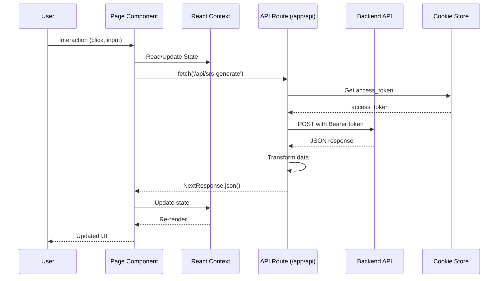
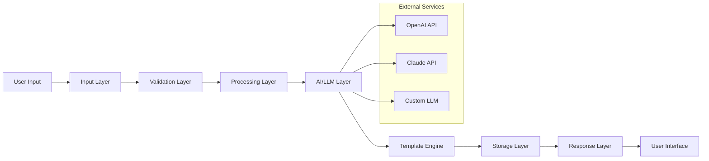
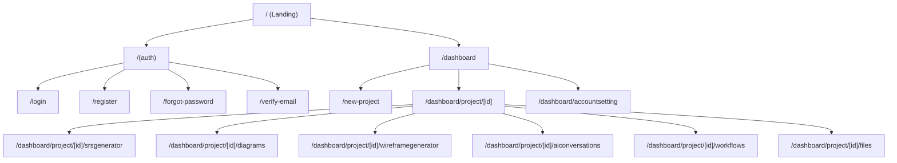

# Frontend Architecture — BA Copilot

This document describes the frontend architecture for the BA Copilot project, providing comprehensive documentation for component models, data flows, state management, routing, testing, and deployment strategies.

**Project**: BA Copilot Frontend  
**Version**: 1.0.0  
**Last Updated**: December 13, 2025  
**Technology Stack**: Next.js 15.5.9, React 19.1.0, TypeScript, Tailwind CSS, Shadcn UI  
**Status**: Active Development (Sprint 2+)

---

## Table of Contents

1. [Main Directory Overview](#main-directory-overview)
2. [Architecture Layers](#architecture-layers)
3. [Core Features](#core-features)
4. [Data Flow Architecture](#data-flow-architecture)
5. [State Management](#state-management)
6. [Authentication & Authorization](#authentication--authorization)
7. [Component Architecture](#component-architecture)
8. [API Integration (BFF Pattern)](#api-integration-bff-pattern)
9. [Routing Structure](#routing-structure)
10. [Testing Strategy](#testing-strategy)
11. [Deployment & DevOps](#deployment--devops)
12. [Best Practices & Conventions](#best-practices--conventions)

---

## Main Directory Overview

### Core Application Structure

#### Root Application Files
- [`app/layout.tsx`](../../app/layout.tsx) — Root layout (theme, global styles, providers)
- [`app/page.tsx`](../../app/page.tsx) — Landing page / Home
- [`app/globals.css`](../../app/globals.css) — Global styles and CSS variables
- [`middleware.ts`](../../middleware.ts) — Next.js middleware for authentication and route protection

#### Authentication Routes (`app/(auth)/`)
- [`app/(auth)/layout.tsx`](../../app/(auth)/layout.tsx) — Authentication group layout
- [`app/(auth)/login/`](../../app/(auth)/login/) — Login page
- [`app/(auth)/register/`](../../app/(auth)/register/) — Registration page
- [`app/(auth)/forgot-password/`](../../app/(auth)/forgot-password/) — Password recovery
- [`app/(auth)/verify-email/`](../../app/(auth)/verify-email/) — Email verification
- [`app/(auth)/verify-success/`](../../app/(auth)/verify-success/) — Verification success notification

### Dashboard & Main Application (`app/dashboard/`)

#### Dashboard Core
- [`app/dashboard/layout.tsx`](../../app/dashboard/layout.tsx) — Main dashboard layout with sidebar and header
- [`app/dashboard/page.tsx`](../../app/dashboard/page.tsx) — Dashboard overview page
- [`app/dashboard/_components/`](../../app/dashboard/_components/) — Dashboard-specific components
- [`app/dashboard/accountsetting/`](../../app/dashboard/accountsetting/) — Account settings

#### Project Management (`app/dashboard/project/`)
- [`app/dashboard/project/[id]/`](../../app/dashboard/project/[id]/) — Dynamic routes for project details
- [`app/dashboard/project/[id]/page.tsx`](../../app/dashboard/project/[id]/page.tsx) — Project overview page
- [`app/dashboard/project/[id]/_components/`](../../app/dashboard/project/[id]/_components/) — Project-specific components

#### Feature Modules

**SRS Generator** — Software Requirements Specification generation
- [`app/dashboard/project/[id]/srsgenerator/`](../../app/dashboard/project/[id]/srsgenerator/)
- Generates comprehensive SRS documents using AI
- Supports file uploads, templates, and document management

**Wireframe Generator** — UI/UX wireframe creation
- [`app/dashboard/project/[id]/wireframegenerator/`](../../app/dashboard/project/[id]/wireframegenerator/)
- Generates wireframes from text descriptions
- HTML/CSS code generation

**Diagram Generator** — Technical diagram creation
- [`app/dashboard/project/[id]/diagrams/`](../../app/dashboard/project/[id]/diagrams/)
- Supports multiple diagram types (Sequence, Class, Use Case, Activity)
- Mermaid diagram generation

**AI Conversations** — Chat interface with AI
- [`app/dashboard/project/[id]/aiconversations/`](../../app/dashboard/project/[id]/aiconversations/)
- Conversational AI assistant for BA tasks
- Context-aware responses

**Workflows** — Process automation
- [`app/dashboard/project/[id]/workflows/`](../../app/dashboard/project/[id]/workflows/)
- Visual workflow builder and management

**File Management** — Document organization
- [`app/dashboard/project/[id]/files/`](../../app/dashboard/project/[id]/files/)
- File upload, organization, and version control

#### New Project Module
- [`app/new-project/`](../../app/new-project/) — **NEW** Project creation wizard
- [`app/new-project/page.tsx`](../../app/new-project/page.tsx) — Project creation page
- [`app/new-project/_components/`](../../app/new-project/_components/) — Creation flow components

### API Routes (Backend for Frontend - BFF Pattern)

Located in [`app/api/`](../../app/api/), these routes act as a proxy layer between frontend and backend:

**Authentication APIs**
- [`app/api/login/route.ts`](../../app/api/login/route.ts) — Login proxy
- [`app/api/register/route.ts`](../../app/api/register/route.ts) — Registration proxy
- [`app/api/logout/route.ts`](../../app/api/logout/route.ts) — Logout handler
- [`app/api/forgot-password/route.ts`](../../app/api/forgot-password/route.ts) — Password reset

**User & Project APIs**
- [`app/api/me/route.ts`](../../app/api/me/route.ts) — Current user information
- [`app/api/projects/route.ts`](../../app/api/projects/route.ts) — Project management (CRUD)

**Feature APIs**
- [`app/api/srs-generate/route.ts`](../../app/api/srs-generate/route.ts) — SRS document generation
- [`app/api/wireframe-generate/`](../../app/api/wireframe-generate/) — **NEW** Wireframe generation
- [`app/api/diagram/`](../../app/api/diagram/) — **NEW** Diagram generation (Sequence, Class, Use Case, Activity)

### Shared Components

#### Layout Components (`components/layout/`)
- [`Sidebar.tsx`](../../components/layout/Sidebar.tsx) — Navigation sidebar
- [`Header.tsx`](../../components/layout/Header.tsx) — Top header with user menu
- [`Footer.tsx`](../../components/layout/Footer.tsx) — Footer component

#### UI Primitives (`components/ui/`)
Shadcn/Radix-based components:
- `button.tsx`, `input.tsx`, `dialog.tsx`, `card.tsx`
- `select.tsx`, `textarea.tsx`, `checkbox.tsx`, `badge.tsx`
- `progress.tsx`, `label.tsx`, `input-otp.tsx`, `alert-dialog.tsx`
- `tabs.tsx`, `tooltip.tsx`, and more

#### Icons (`components/icons/`)
- [`index.ts`](../../components/icons/index.ts) — Icon exports
- [`project-icons.tsx`](../../components/icons/project-icons.tsx) — Project-specific icons

#### Chat Bot Module (`components/chat-bot/`) — **NEW**
AI-powered chat interface with reusable configuration:
- [`ChatBot.tsx`](../../components/chat-bot/ChatBot.tsx) — Main chat interface
- [`ChatWithAI.tsx`](../../components/chat-bot/ChatWithAI.tsx) — Chat logic wrapper
- [`chat-configs.ts`](../../components/chat-bot/chat-configs.ts) — Reusable API configurations
- Supports multiple features: SRS, Diagrams, Wireframes
- Feature-agnostic design with flexible API integration

#### File Management (`components/file-management/`) — **NEW**
Composite pattern-based file explorer:
- [`FileManagement.tsx`](../../components/file-management/FileManagement.tsx) — Main container
- [`FolderComposite.tsx`](../../components/file-management/FolderComposite.tsx) — Folder node component
- [`FileLeaf.tsx`](../../components/file-management/FileLeaf.tsx) — File node component
- [`IFileRepository.ts`](../../components/file-management/IFileRepository%20.ts) — Repository interface
- [`ApiRepository.ts`](../../components/file-management/ApiRepository.ts) — API implementation
- [`MockFileRepository.ts`](../../components/file-management/MockFileRepository%20.ts) — Mock for testing

#### File Upload (`components/file/`)
- [`FileUpload.tsx`](../../components/file/FileUpload.tsx) — File upload component

### State Management & Context

- [`context/FileContext.tsx`](../../context/FileContext.tsx) — File upload state management
- [`context/SRSGeneratorContext.tsx`](../../context/SRSGeneratorContext.tsx) — SRS form sections state

### Business Logic & Custom Hooks

#### Libraries (`lib/`)
- [`lib/user.ts`](../../lib/user.ts) — User-related utilities and API calls
- [`lib/projects.ts`](../../lib/projects.ts) — Project-related utilities and API calls
- [`lib/utils.ts`](../../lib/utils.ts) — Shared utility functions (cn, validators, formatters)

#### Custom Hooks (`hooks/`) — **NEW**
- [`hooks/use-srs-doc.ts`](../../hooks/use-srs-doc.ts) — SRS document logic
- [`hooks/use-wireframe.ts`](../../hooks/use-wireframe.ts) — Wireframe generation logic

### Configuration & Setup

- [`next.config.ts`](../../next.config.ts) — Next.js configuration
- [`tsconfig.json`](../../tsconfig.json) — TypeScript configuration
- [`components.json`](../../components.json) — Shadcn UI configuration
- [`eslint.config.mjs`](../../eslint.config.mjs) — ESLint rules
- [`.prettierrc`](../../.prettierrc) — Prettier formatting
- [`postcss.config.mjs`](../../postcss.config.mjs) — PostCSS configuration
- [`tailwind.config.ts`](../../tailwind.config.ts) — Tailwind CSS configuration (implied)
- [`package.json`](../../package.json) — Dependencies and scripts

### Docker & Deployment

- [`docker-compose.yml`](../../docker-compose.yml) — Local development container setup
- [`Dockerfile`](../../Dockerfile) — Production container image

### Documentation

- [`docs/`](../../docs/) — Comprehensive documentation
  - [`architecture/`](../../docs/architecture/) — Architecture documentation
  - [`flow/`](../../docs/flow/) — Feature flow diagrams
  - [`project-plan/`](../../docs/project-plan/) — Development plans
  - [`prd/`](../../docs/prd/) — Product requirements
  - [`usecase/`](../../docs/usecase/) — Use case specifications
  - [`test/`](../../docs/test/) — Test documentation and cases

### Static Assets

- [`public/`](../../public/) — Static files (images, icons, fonts)
- [`public/mock/`](../../public/mock/) — Mock data for development

---

## Architecture Layers

### 1. Presentation Layer (Pages & Layouts)

Routes and page components in [`app/`](../../app/) using Next.js 15 App Router:

- **Route Groups**: `(auth)` for authentication flows
- **Dynamic Routes**: `[id]` for project-specific pages
- **Nested Layouts**: Hierarchical layout system (root → dashboard → feature-specific)
- **Server Components**: Default rendering strategy, client components when interactivity is needed

### 2. UI Components Layer

**Component Hierarchy**:
- **Primitives**: [`components/ui/`](../../components/ui/) — Base components from Shadcn UI
- **Layout Components**: [`components/layout/`](../../components/layout/) — Reusable layout pieces
- **Feature Components**: Located in `_components/` within each feature directory
- **Specialized Modules**:
  - **Chat Bot**: Independent AI communication module with flexible API configuration
  - **File Management**: Composite pattern for complex folder/file structures
  - **Icons**: Centralized icon management

### 3. State Management Layer

**State Management Strategy**:
- **React Context**:
  - `FileContext` — File upload state
  - `SRSGeneratorContext` — SRS form sections state
- **Server State**: TanStack Query / React Query (recommended for data fetching)
- **Local State**: useState/useReducer in components
- **URL State**: searchParams for filters, tabs, pagination
- **Form State**: React Hook Form (recommended) or controlled components

### 4. API Layer (BFF Pattern)

API routes in [`app/api/`](../../app/api/) serve as Backend-for-Frontend:
- Proxy requests to backend API
- Handle cookie-based authentication (access_token)
- Transform data if needed
- Error handling and logging
- Example: [`app/api/srs-generate/route.ts`](../../app/api/srs-generate/route.ts)

### 5. Business Logic Layer

Helpers and utilities in [`lib/`](../../lib/) and [`hooks/`](../../hooks/):
- `lib/user.ts` — User operations
- `lib/projects.ts` — Project CRUD
- `lib/utils.ts` — Shared utilities
- Custom hooks for feature-specific logic

### 6. Configuration & Assets Layer

- Environment variables: `.env`, `.env.sample`
- Static assets: `public/`
- Build configurations: `next.config.ts`, `tsconfig.json`

---

## Core Features

### 1. SRS Generator
**Location**: [`app/dashboard/project/[id]/srsgenerator/`](../../app/dashboard/project/[id]/srsgenerator/)

**Capabilities**:
- AI-powered SRS document generation
- File upload support (Markdown)
- Template-based generation
- Section management (Project Overview, Functional Requirements, Non-Functional Requirements, Diagrams)
- Document versioning and history
- Export to multiple formats

**Components**:
- `MainPage.tsx` — Main orchestrator
- `FileUpload.tsx` — File upload widget
- `ProjectOverview.tsx` — Project metadata
- `Requirements.tsx` — Requirements input
- `Diagrams.tsx` — Diagram references
- `DocumentViewer.tsx` — Document preview and editing

### 2. Wireframe Generator
**Location**: [`app/dashboard/project/[id]/wireframegenerator/`](../../app/dashboard/project/[id]/wireframegenerator/)

**Capabilities**:
- Generate wireframes from text descriptions
- HTML/CSS code generation
- Interactive preview
- Export and sharing

### 3. Diagram Generator
**Location**: [`app/dashboard/project/[id]/diagrams/`](../../app/dashboard/project/[id]/diagrams/)

**Supported Diagram Types**:
- Sequence Diagrams
- Class Diagrams
- Use Case Diagrams
- Activity Diagrams

**Features**:
- Mermaid diagram generation
- Visual editor
- Export to image/code

### 4. AI Conversations
**Location**: [`app/dashboard/project/[id]/aiconversations/`](../../app/dashboard/project/[id]/aiconversations/)

**Capabilities**:
- Context-aware AI assistant
- Conversation history
- Multi-turn dialogues
- Feature-specific assistance

### 5. Workflow Management
**Location**: [`app/dashboard/project/[id]/workflows/`](../../app/dashboard/project/[id]/workflows/)

**Features**:
- Visual workflow builder
- Process automation
- Task management

### 6. File Management
**Location**: [`app/dashboard/project/[id]/files/`](../../app/dashboard/project/[id]/files/)

**Capabilities**:
- File upload and organization
- Folder structure management (Composite Pattern)
- Version control
- File sharing

---

## Data Flow Architecture

### Primary Data Flow Sequence



### Data Flow Layers



---

## State Management

### Client State Management

#### React Context API
Used for feature-specific state that needs to be shared across components:

```typescript
// FileContext - Manages uploaded files
const { files, addFile, removeFile, clearFiles } = useFileContext();

// SRSGeneratorContext - Manages SRS form sections
const { 
  projectOverview, 
  functionalRequirements, 
  updateProjectOverview,
  updateFunctionalRequirements 
} = useSRSGeneratorContext();
```

#### Local Component State
For UI-specific state:
```typescript
const [isOpen, setIsOpen] = useState(false);
const [selectedTab, setSelectedTab] = useState('overview');
```

### Server State Management

**Recommended: TanStack Query (React Query)**

For data fetching, caching, and synchronization:
```typescript
const { data: projects, isLoading } = useQuery({
  queryKey: ['projects'],
  queryFn: () => fetchProjects()
});
```

Benefits:
- Automatic caching
- Background refetching
- Optimistic updates
- Request deduplication

### URL State Management

For shareable and bookmarkable state:
```typescript
const searchParams = useSearchParams();
const tab = searchParams.get('tab') || 'overview';
const documentId = searchParams.get('doc');
```

Use cases:
- Active tabs
- Filters and sorting
- Pagination
- Document selection

### Form State Management

**Recommended: React Hook Form + Zod**

```typescript
const { 
  register, 
  handleSubmit, 
  formState: { errors } 
} = useForm({
  resolver: zodResolver(schema)
});
```

---

## Authentication & Authorization

### Cookie-Based Authentication

**Flow**:
1. User logs in via [`/api/login`](../../app/api/login/route.ts)
2. Backend returns access_token and refresh_token
3. API route sets httpOnly cookies
4. Middleware [`middleware.ts`](../../middleware.ts) checks cookies on protected routes
5. Automatic token refresh using refresh_token
6. Redirect to `/login` if authentication fails

### Middleware Protection

```typescript
// middleware.ts
export async function middleware(req: NextRequest) {
    const accessToken = req.cookies.get("access_token")?.value;
    const refreshToken = req.cookies.get("refresh_token")?.value;
    
    if (!accessToken) {
        if (refreshToken) {
            // Attempt to refresh token
            const res = await fetch(`${process.env.BACKEND_DOMAIN}/api/v1/auth/refresh`, {
                method: 'POST',
                body: JSON.stringify({ refresh_token: refreshToken }),
            });
            
            if (res.ok) {
                const response = await res.json();
                const nextRes = NextResponse.next();
                nextRes.cookies.set('access_token', response.accessToken, {
                    httpOnly: true,
                    sameSite: 'lax',
                    expires: new Date(Date.now() + 30 * 60 * 1000),
                });
                return nextRes;
            }
        }
        
        // No valid token, redirect to login
        return NextResponse.redirect(new URL(`/login`, req.url));
    }
    
    return NextResponse.next();
}

export const config = {
    matcher: ["/dashboard/:path*"],
}
```

### Protected Routes

All routes under `/dashboard/*` are protected by middleware:
- Automatic authentication check
- Token refresh on expiration
- Seamless redirect to login if needed

### API Authentication

API routes access the access_token from cookies:

```typescript
export async function POST(request: NextRequest) {
    const access_token = (await cookies()).get('access_token')?.value;
    
    const response = await fetch(`${process.env.BACKEND_DOMAIN}/api/v1/...`, {
        headers: {
            'Authorization': `Bearer ${access_token}`,
        },
    });
    
    return NextResponse.json(await response.json());
}
```

---

## Component Architecture

### Component Hierarchy

```
app/layout.tsx (Root Providers)
└── app/dashboard/layout.tsx (Dashboard Shell)
    ├── components/layout/Sidebar.tsx
    ├── components/layout/Header.tsx
    └── app/dashboard/project/[id]/srsgenerator/page.tsx
        ├── FileDataStoreProvider
        └── SrsDataStoreProvider
            ├── MainPage (Create new tab)
            ├── Template (Template tab)
            ├── RecentDocument (Recent tab)
            └── DocumentViewer (View mode)
```

### Component Patterns

#### Server Components (Default)
Used for pages and layouts without interactivity:
```typescript
// app/dashboard/page.tsx - Server Component
export default async function DashboardPage() {
  const data = await fetchData(); // Can use async/await
  return <Dashboard data={data} />;
}
```

#### Client Components
Used for interactive components:
```typescript
'use client';

export default function InteractiveButton() {
  const [count, setCount] = useState(0);
  return <button onClick={() => setCount(count + 1)}>{count}</button>;
}
```

#### Composition Pattern
Building complex UIs from simple primitives:
```typescript
import { Button } from '@/components/ui/button';
import { Card, CardHeader, CardContent } from '@/components/ui/card';

export function ProjectCard() {
  return (
    <Card>
      <CardHeader>Project Title</CardHeader>
      <CardContent>
        <p>Description</p>
        <Button>View Project</Button>
      </CardContent>
    </Card>
  );
}
```

#### Composite Pattern
Used in File Management for tree structures:
```typescript
// FolderComposite.tsx - Can contain files and folders
interface IFileSystemComponent {
  render(): JSX.Element;
  add(component: IFileSystemComponent): void;
  remove(component: IFileSystemComponent): void;
}

// FileLeaf.tsx - Leaf node (file)
// FolderComposite.tsx - Composite node (folder)
```

#### Feature Co-location
Components specific to a feature are placed in `_components/`:
```
app/dashboard/project/[id]/srsgenerator/
├── page.tsx
└── _components/
    ├── MainPage.tsx
    ├── FileUpload.tsx
    ├── ProjectOverview.tsx
    └── Requirements.tsx
```

---

## API Integration (BFF Pattern)

### Backend for Frontend Architecture

All frontend API calls go through Next.js API routes in [`app/api/`](../../app/api/):

**Benefits**:
- Security: Hides backend URLs and API keys
- Cookie management: Handles httpOnly cookies
- Data transformation: Adapts backend responses for frontend
- Error handling: Centralized error management
- Type safety: Maintains TypeScript types

### Example API Route

```typescript
// app/api/srs-generate/route.ts
import { NextRequest, NextResponse } from 'next/server';
import { cookies } from 'next/headers';

export async function POST(request: NextRequest) {
    try {
        // Get authentication token from cookie
        const access_token = (await cookies()).get('access_token')?.value;
        
        if (!access_token) {
            return NextResponse.json(
                { error: 'Unauthorized' },
                { status: 401 }
            );
        }
        
        // Parse request data
        const formData = await request.formData();
        
        // Forward to backend API
        const response = await fetch(
            `${process.env.BACKEND_DOMAIN}/api/v1/srs/generate`,
            {
                method: 'POST',
                headers: {
                    'Authorization': `Bearer ${access_token}`,
                },
                body: formData
            }
        );
        
        // Handle backend response
        if (!response.ok) {
            const error = await response.json();
            return NextResponse.json(error, { status: response.status });
        }
        
        const data = await response.json();
        
        // Transform and return data
        return NextResponse.json(data);
        
    } catch (error) {
        console.error('API Error:', error);
        return NextResponse.json(
            { error: 'Internal Server Error' },
            { status: 500 }
        );
    }
}
```

### Frontend API Calls

```typescript
// In a client component
async function generateSRS(formData: FormData) {
  const response = await fetch('/api/srs-generate', {
    method: 'POST',
    body: formData
  });
  
  if (!response.ok) {
    throw new Error('Failed to generate SRS');
  }
  
  return response.json();
}
```

### Environment Variables

Required environment variables in `.env`:

```bash
# Backend API URL
BACKEND_DOMAIN=http://localhost:8010

# Public variables (accessible in browser)
NEXT_PUBLIC_APP_NAME=BA Copilot
```

---

## Routing Structure

### Route Organization

```
/                           # Landing page
├── (auth)                  # Authentication group
│   ├── login              # Login page
│   ├── register           # Registration page
│   ├── forgot-password    # Password recovery
│   ├── verify-email       # Email verification
│   └── verify-success     # Success notification
│
└── dashboard               # Main application (protected)
    ├── /                  # Dashboard overview
    ├── new-project        # Project creation wizard
    ├── accountsetting     # Account settings
    │
    └── project/[id]       # Dynamic project routes
        ├── /              # Project overview
        ├── srsgenerator   # SRS Generator
        ├── wireframegenerator # Wireframe Generator
        ├── diagrams       # Diagram Generator
        ├── aiconversations # AI Chat
        ├── workflows      # Workflow Management
        └── files          # File Management
```

### Route Navigation Diagram



---

## Testing Strategy

### Test Documentation

Comprehensive test documentation in [`docs/test/`](../../docs/test/):

- **Dashboard Tests**: [`docs/test/dashboard/`](../../docs/test/dashboard/)
- **Login Tests**: [`docs/test/login/`](../../docs/test/login/)
- **Register Tests**: [`docs/test/register/`](../../docs/test/register/)
- **Forgot Password Tests**: [`docs/test/forget-password/`](../../docs/test/forget-password/)
- **User Profile Tests**: [`docs/test/user-profile/`](../../docs/test/user-profile/)

### Testing Pyramid

```
        ┌─────────────────┐
        │   E2E Tests     │  ← Small number, high confidence
        │   (Playwright)  │
        ├─────────────────┤
        │ Integration     │  ← Medium number
        │ Tests (RTL)     │
        ├─────────────────┤
        │  Unit Tests     │  ← Large number, fast
        │    (Jest)       │
        └─────────────────┘
```

### Recommended Testing Tools

**Unit Testing**:
- **Jest** — Test runner and assertion library
- **React Testing Library** — Component testing
- Test files: `*.test.ts`, `*.test.tsx`

**Integration Testing**:
- **React Testing Library** — Multi-component interactions
- **MSW (Mock Service Worker)** — API mocking

**End-to-End Testing**:
- **Playwright** — Browser automation
- **Cypress** — Alternative E2E framework

**Component Documentation**:
- **Storybook** (optional) — Component showcase and documentation

### Test Structure Example

```typescript
// __tests__/components/Button.test.tsx
import { render, screen, fireEvent } from '@testing-library/react';
import { Button } from '@/components/ui/button';

describe('Button Component', () => {
  it('renders button with text', () => {
    render(<Button>Click me</Button>);
    expect(screen.getByText('Click me')).toBeInTheDocument();
  });
  
  it('calls onClick when clicked', () => {
    const handleClick = jest.fn();
    render(<Button onClick={handleClick}>Click me</Button>);
    fireEvent.click(screen.getByText('Click me'));
    expect(handleClick).toHaveBeenCalledTimes(1);
  });
});
```

---

## Deployment & DevOps

### Local Development

**With npm**:
```bash
# Install dependencies
npm install

# Run development server
npm run dev

# Build for production
npm run build

# Start production server
npm start

# Lint code
npm run lint
```

**With Docker**:
```bash
# Navigate to project directory
cd ba-copilot

# Start containers
docker-compose up --build -d

# View logs
docker-compose logs -f

# Stop containers
docker-compose down
```

### Environment Setup

1. Copy `.env.sample` to `.env`:
   ```bash
   cp .env.sample .env
   ```

2. Configure environment variables:
   ```bash
   # Backend API URL
   # Use http://localhost:8010 for npm development
   # Use http://host.docker.internal:8010 for Docker development
   BACKEND_DOMAIN=http://localhost:8010
   
   # Other configurations...
   ```

3. Ensure backend API is running

4. Start development server:
   ```bash
   npm run dev
   ```

### Docker Deployment

**Development Container** ([`docker-compose.yml`](../../docker-compose.yml)):
```yaml
services:
  ba-copilot-frontend:
    build: .
    ports:
      - "3000:3000"
    environment:
      - BACKEND_DOMAIN=http://host.docker.internal:8010
    volumes:
      - .:/app
      - /app/node_modules
```

**Production Dockerfile** ([`Dockerfile`](../../Dockerfile)):
- Multi-stage build for optimized image size
- Node.js base image
- Production dependencies only
- Optimized for performance

### Build & Deployment

**Production Build**:
```bash
# Build optimized production bundle
npm run build

# Output: .next/ directory
```

**Deployment Platforms**:
- **Vercel** — Recommended for Next.js (automatic optimizations)
- **Netlify** — Alternative platform
- **Docker** — Self-hosted on any cloud provider
- **AWS/Azure/GCP** — Enterprise cloud deployment

### CI/CD Pipeline

**Recommended: GitHub Actions**

```yaml
name: CI/CD Pipeline

on:
  push:
    branches: [ main, develop ]
  pull_request:
    branches: [ main, develop ]

jobs:
  test:
    runs-on: ubuntu-latest
    steps:
      - uses: actions/checkout@v3
      - name: Setup Node.js
        uses: actions/setup-node@v3
        with:
          node-version: '20'
      - name: Install dependencies
        run: npm ci
      - name: Run linter
        run: npm run lint
      - name: Run tests
        run: npm test
      - name: Build
        run: npm run build
  
  deploy:
    needs: test
    runs-on: ubuntu-latest
    if: github.ref == 'refs/heads/main'
    steps:
      - name: Deploy to production
        run: # Deployment commands
```

---

## Best Practices & Conventions

### Code Organization

**File Structure**:
- **Feature-based** structure in `app/` routes
- **Shared components** in `components/`
- **Business logic** in `lib/` and `hooks/`
- **Type definitions** co-located or in `types/`

**Co-location Principle**:
```
app/dashboard/project/[id]/srsgenerator/
├── page.tsx                    # Route entry point
├── layout.tsx                  # Feature layout (if needed)
└── _components/                # Feature-specific components
    ├── MainPage.tsx
    ├── FileUpload.tsx
    └── ProjectOverview.tsx
```

### Naming Conventions

**Components**:
- PascalCase: `Button.tsx`, `UserProfile.tsx`, `SRSGenerator.tsx`

**Utilities**:
- camelCase: `formatDate.ts`, `validateEmail.ts`, `apiClient.ts`

**Routes**:
- kebab-case: `/forgot-password`, `/account-setting`, `/new-project`

**Constants**:
- UPPER_SNAKE_CASE: `API_BASE_URL`, `MAX_FILE_SIZE`

### TypeScript Best Practices

**Type Definitions**:
```typescript
// Prefer interfaces for objects
interface User {
  id: string;
  name: string;
  email: string;
}

// Use types for unions and primitives
type Status = 'pending' | 'active' | 'completed';
type ID = string | number;

// Co-locate types with components
interface ProjectCardProps {
  project: Project;
  onSelect: (id: string) => void;
}

export function ProjectCard({ project, onSelect }: ProjectCardProps) {
  // Component implementation
}
```

**Avoid `any`**:
```typescript
// Bad
function processData(data: any) { ... }

// Good
interface DataInput {
  id: string;
  value: number;
}

function processData(data: DataInput) { ... }

// Or use unknown for truly unknown types
function processData(data: unknown) {
  if (typeof data === 'object' && data !== null) {
    // Type narrowing
  }
}
```

### Performance Optimization

**Server Components by Default**:
- Use Server Components for static content
- Only add `'use client'` when needed for interactivity

**Dynamic Imports**:
```typescript
// Lazy load heavy components
import dynamic from 'next/dynamic';

const HeavyChart = dynamic(() => import('@/components/HeavyChart'), {
  loading: () => <p>Loading chart...</p>,
  ssr: false // Disable server-side rendering if needed
});
```

**Image Optimization**:
```typescript
import Image from 'next/image';

<Image 
  src="/project-icon.png" 
  alt="Project" 
  width={200} 
  height={200}
  priority // For above-the-fold images
/>
```

**Code Splitting**:
- Automatic with Next.js
- Each route gets its own bundle
- Shared code extracted automatically

### Accessibility (a11y)

**Semantic HTML**:
```tsx
// Good
<header>
  <nav>
    <ul>
      <li><a href="/dashboard">Dashboard</a></li>
    </ul>
  </nav>
</header>

// Bad
<div className="header">
  <div className="nav">
    <div className="item">Dashboard</div>
  </div>
</div>
```

**ARIA Labels**:
```tsx
<button 
  aria-label="Close modal"
  onClick={handleClose}
>
  <CloseIcon />
</button>
```

**Keyboard Navigation**:
- Ensure all interactive elements are keyboard accessible
- Manage focus states
- Provide keyboard shortcuts where appropriate

**Focus Management**:
```typescript
import { useRef, useEffect } from 'react';

function Modal({ isOpen }) {
  const modalRef = useRef<HTMLDivElement>(null);
  
  useEffect(() => {
    if (isOpen && modalRef.current) {
      modalRef.current.focus();
    }
  }, [isOpen]);
  
  return <div ref={modalRef} tabIndex={-1}>...</div>;
}
```

### Error Handling

**Error Boundaries**:
```typescript
// app/error.tsx - Route error boundary
'use client';

export default function Error({
  error,
  reset,
}: {
  error: Error & { digest?: string };
  reset: () => void;
}) {
  return (
    <div>
      <h2>Something went wrong!</h2>
      <button onClick={() => reset()}>Try again</button>
    </div>
  );
}
```

**API Error Handling**:
```typescript
async function fetchData() {
  try {
    const response = await fetch('/api/data');
    
    if (!response.ok) {
      throw new Error(`HTTP error! status: ${response.status}`);
    }
    
    return await response.json();
  } catch (error) {
    console.error('Fetch error:', error);
    throw error; // Re-throw for upstream handling
  }
}
```

### Security Best Practices

**Input Validation**:
- Validate all user inputs
- Use Zod or similar for schema validation
- Sanitize data before display

**XSS Prevention**:
- React automatically escapes JSX content
- Be careful with `dangerouslySetInnerHTML`
- Use DOMPurify for sanitizing HTML

**CSRF Protection**:
- Next.js API routes have built-in CSRF protection
- Use httpOnly cookies for sensitive data

**Environment Variables**:
```bash
# Never commit secrets to git
# Use .env.local for sensitive data (automatically ignored)

# .env.local (not in git)
DATABASE_URL=postgresql://...
API_SECRET_KEY=...

# .env.sample (committed to git)
DATABASE_URL=
API_SECRET_KEY=
```

---

## Performance Metrics

### Core Web Vitals

**Target Metrics**:
- **LCP (Largest Contentful Paint)**: < 2.5s
- **FID (First Input Delay)**: < 100ms
- **CLS (Cumulative Layout Shift)**: < 0.1

**Monitoring**:
- Use Vercel Analytics
- Google Lighthouse
- WebPageTest

### Bundle Size

**Optimization Strategies**:
- Tree shaking (automatic with Next.js)
- Code splitting by route
- Dynamic imports for heavy components
- Analyze bundle with `@next/bundle-analyzer`

```bash
# Install bundle analyzer
npm install --save-dev @next/bundle-analyzer

# Analyze bundle
ANALYZE=true npm run build
```

---

## Recommendations & Next Steps

### Immediate Improvements

1. **Setup TanStack Query**
   - Implement for all data fetching
   - Configure cache invalidation strategies
   - Add optimistic updates

2. **Implement Error Boundaries**
   - Add error.tsx at strategic levels
   - Create custom error UI
   - Add error logging service

3. **Add Loading States**
   - Use Suspense boundaries
   - Create loading.tsx files
   - Implement skeleton screens

4. **Setup E2E Testing**
   - Install Playwright
   - Write tests based on docs/test/
   - Integrate with CI/CD

### Future Enhancements

1. **Performance Monitoring**
   - Integrate Vercel Analytics or similar
   - Set up custom performance tracking
   - Monitor Core Web Vitals

2. **Internationalization (i18n)**
   - Setup next-intl or similar
   - Create translation files
   - Support multiple languages

3. **Progressive Web App (PWA)**
   - Add manifest.json
   - Implement service workers
   - Enable offline functionality

4. **Advanced Features**
   - Real-time collaboration (WebSockets)
   - Advanced caching strategies
   - Micro-frontend architecture

---

## Technology Stack Summary

### Core Technologies
- **Framework**: Next.js 15.5.9 (App Router)
- **React**: 19.1.0
- **TypeScript**: Latest
- **Styling**: Tailwind CSS 4.x + PostCSS
- **UI Components**: Shadcn UI (Radix UI primitives)

### Key Dependencies
- **State Management**: React Context, (TanStack Query recommended)
- **Form Handling**: React Hook Form (recommended)
- **Validation**: Zod
- **HTTP Client**: Fetch API, Axios
- **Markdown**: React Markdown, Remark plugins
- **Diagrams**: Mermaid
- **Icons**: Lucide React, React Icons, Heroicons
- **Styling**: clsx, tailwind-merge, class-variance-authority

### Development Tools
- **Package Manager**: npm
- **Linting**: ESLint
- **Formatting**: Prettier
- **Testing**: Jest, React Testing Library, Playwright (recommended)
- **Version Control**: Git
- **Containerization**: Docker

---

## References & Resources

### Internal Documentation
- **Project Plan**: [`docs/project-plan/fe-project-plan.md`](../../docs/project-plan/fe-project-plan.md)
- **Product Requirements**: [`docs/prd/product-requirements-document.md`](../../docs/prd/product-requirements-document.md)
- **Use Cases**: [`docs/usecase/use-case-specification.md`](../../docs/usecase/use-case-specification.md)
- **SRS Generator Flow**: [`docs/flow/srs_generator_flow.md`](../../docs/flow/srs_generator_flow.md)
- **Test Documentation**: [`docs/test/`](../../docs/test/)

### External Resources
- **Next.js Documentation**: https://nextjs.org/docs
- **React Documentation**: https://react.dev
- **Shadcn UI**: https://ui.shadcn.com
- **Tailwind CSS**: https://tailwindcss.com
- **TanStack Query**: https://tanstack.com/query
- **TypeScript**: https://www.typescriptlang.org

---

## Changelog

### Version 1.0.0 (December 13, 2025)
- Complete architecture documentation
- Documented all current features
- Added comprehensive examples
- Translated to English
- Updated with latest project structure
- Added new features: Chat Bot, File Management, Diagrams, Workflows, AI Conversations

---

**Document Maintained By**: BA Copilot Frontend Team  
**Last Review Date**: December 13, 2025  
**Next Review Date**: March 2026
