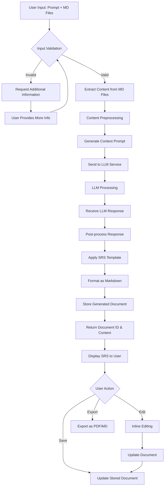
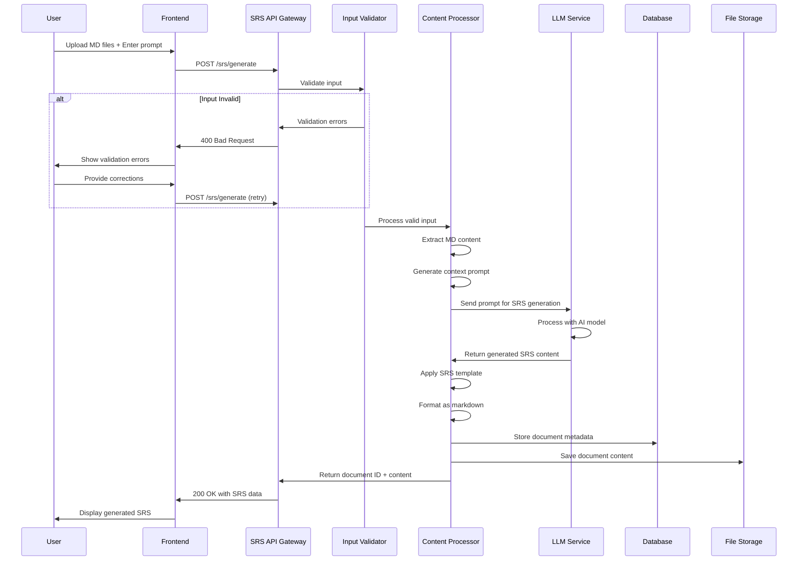
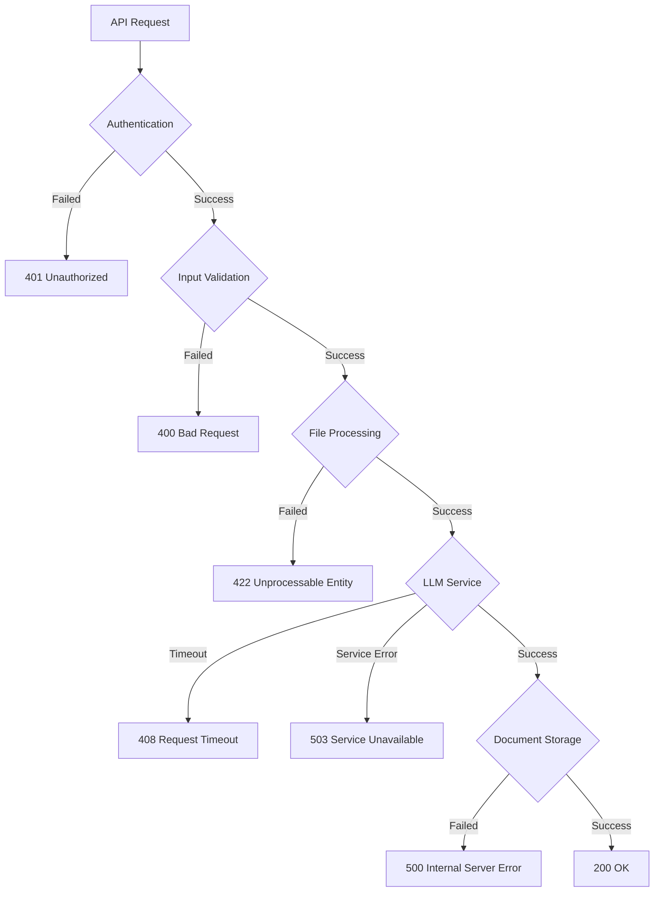
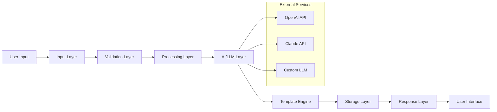
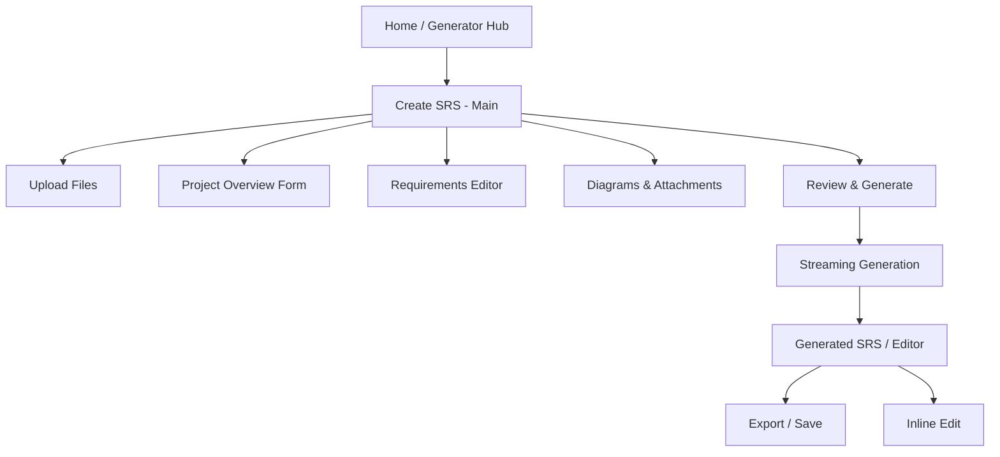
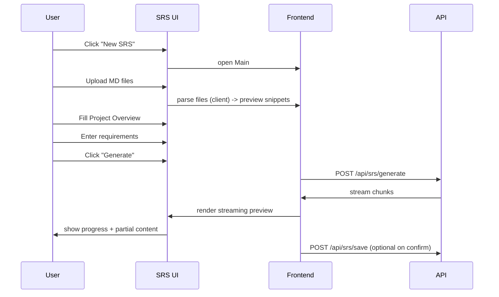
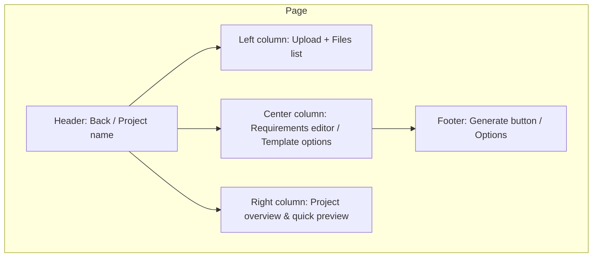

# SRS Generator Service Flow Diagram

## Overview

The SRS Generator service automates the creation of Software Requirements Specification documents based on user prompts and uploaded Markdown documents.

## Primary Flow Diagram



## Detailed Technical Flow



## Error Handling Flow



## Data Flow Architecture



...existing code...

# Frontend -> API: Detailed Next Processing Flow (based on current UI components)

This section describes the next steps the frontend will take to turn the UI built in the srsgenerator folder into a full request/response cycle and UX for SRS generation. The implementation maps directly to the UI pieces in the repository:

- UI entry / orchestrator: [app/(generator)/srsgenerator/_components/MainPage.tsx](app/(generator)/srsgenerator/_components/MainPage.tsx) (local action: [`GenerateDocument`](app/(generator)/srsgenerator/_components/MainPage.tsx))
- Upload widget: [`FileUpload`](app/(generator)/srsgenerator/_components/FileUpload.tsx)
- Project metadata: [`ProjectOverview`](app/(generator)/srsgenerator/_components/ProjectOverview.tsx)
- Requirements input: [`Requirements`](app/(generator)/srsgenerator/_components/Requirements.tsx)
- Diagrams input: [`Diagrams`](app/(generator)/srsgenerator/_components/Diagrams.tsx)
- Client state snapshot / store accessor: [`useSRSGeneratorDataStore`](context/SRSGeneratorContext.tsx)

Flow steps (frontend responsibilities)

1. Collect inputs from UI components
   - Read uploaded files and metadata from [`FileUpload`](app/(generator)/srsgenerator/_components/FileUpload.tsx).
   - Read project overview fields from [`ProjectOverview`](app/(generator)/srsgenerator/_components/ProjectOverview.tsx).
   - Read functional & non-functional requirements from [`Requirements`](app/(generator)/srsgenerator/_components/Requirements.tsx).
   - Read diagrams and references from [`Diagrams`](app/(generator)/srsgenerator/_components/Diagrams.tsx).
   - Aggregate current state using [`useSRSGeneratorDataStore`](context/SRSGeneratorContext.tsx).

2. Client-side validation & preprocessing
   - Validate required fields (title, scope, at least one requirement or uploaded MD file).
   - Validate uploaded files are Markdown (.md) and size limits.
   - Extract plain text / sections from uploaded Markdown files in the browser where possible (strip frontmatter, preserve headings).
   - Build a compact "context envelope" that includes project overview, requirements summary, and key snippets extracted from uploaded MD files.

3. Build the generation payload
   - Create a JSON payload:
     - metadata: project overview fields
     - requirements: structured requirement list
     - diagrams: textual descriptions or diagram references
     - mdFiles: extracted markdown snippets (or optionally, base64 / file-references if server-side processing needed)
     - userPrompt: optional user prompt/notes from the UI
     - options: template variant, verbosity, sections to include
   - This orchestration is triggered by the [`GenerateDocument`](app/(generator)/srsgenerator/_components/MainPage.tsx) action.

4. Submit to SRS generation API
   - POST payload to the backend endpoint (e.g., POST /api/srs/generate). The API should map to the service described in the existing flow diagram.
   - Show an inline progress state in the UI (e.g., "Preparing context → Sending to AI → Rendering SRS").
   - Include a request-id or client-generated id for tracing and retry/de-duplication.

5. UX for long-running LLM calls
   - Use streaming if backend supports it (partial content updates).
   - Provide cancellable requests and a retry button.
   - Map backend error statuses to friendly UI:
     - 400 → show validation errors and highlight offending UI fields.
     - 408 / timeout → "Generation timed out. Try again or simplify input."
     - 503 → "AI service temporarily unavailable. Retry later."

6. Receive and render the SRS result
   - On success, backend returns structured SRS (Markdown string + metadata + optional attachments).
   - Persist result into the client-side data store via [`useSRSGeneratorDataStore`](context/SRSGeneratorContext.tsx) so UI components can render and edit it inline.
   - Display the generated document in an editor/preview; allow switching between "Preview (Markdown)" and "Edit (WYSIWYG/Inline)".

7. Inline editing and user actions
   - Allow edits in-place; maintain an "unsaved changes" state in the store.
   - Actions:
     - Edit → inline WYSIWYG or markdown editor.
     - Export → download as Markdown or generate PDF from Markdown.
     - Save → POST /api/srs/save (store metadata + document content + attachments).
     - Re-generate section → send a targeted prompt to regenerate only specific sections (partial context update).

8. Attachments & diagrams handling
   - If diagrams are uploaded or generated, store as attachments and show references inside the SRS.
   - Provide a "Regenerate diagram" action that sends the diagram description to the diagram generation service (if available) and replaces the attachment.

9. Client-side retries & idempotency
   - Use request idempotency keys for generation calls so retries do not cause duplicate saved documents.
   - Keep local history of requests in the store for debugging and "undo" functionality.

10. Telemetry & error reporting
    - Send non-sensitive telemetry on generation success/error for monitoring.
    - Surface backend request-id to users when an error occurs to facilitate support.

Integration pointers (files & symbols)

- Orchestrator and button that kicks off the flow: [app/(generator)/srsgenerator/_components/MainPage.tsx](app/(generator)/srsgenerator/_components/MainPage.tsx) → [`GenerateDocument`](app/(generator)/srsgenerator/_components/MainPage.tsx)
- Upload component: [app/(generator)/srsgenerator/_components/FileUpload.tsx](app/(generator)/srsgenerator/_components/FileUpload.tsx) → supplies MD files and extracted text
- Form inputs: [app/(generator)/srsgenerator/_components/ProjectOverview.tsx](app/(generator)/srsgenerator/_components/ProjectOverview.tsx), [app/(generator)/srsgenerator/_components/Requirements.tsx](app/(generator)/srsgenerator/_components/Requirements.tsx)
- Diagrams/attachments: [app/(generator)/srsgenerator/_components/Diagrams.tsx](app/(generator)/srsgenerator/_components/Diagrams.tsx)
- Client store: [`useSRSGeneratorDataStore`](context/SRSGeneratorContext.tsx)

UX mapping to the service flow diagram
- The frontend steps described here are the expanded implementation of "User Input" -> "Content Preprocessing" -> "Generate Context Prompt" -> "Send to LLM Service" nodes in the original diagram.
- The frontend must also implement client-side error handling and user correction loops before the API call (validation), corresponding to the "Request Additional Information" loop.

Next implementation tasks (suggested)
- Implement a payload builder that normalizes uploaded MD files into structured sections.
- Add streaming UI that can accept partial responses from the backend.
- Add export endpoints (MD → PDF) on the backend and wire frontend export buttons.
- Implement idempotency keys and client-side retry UI.

Files to inspect while implementing:
- [app/(generator)/srsgenerator/page.tsx](app/(generator)/srsgenerator/page.tsx)
- [app/(generator)/srsgenerator/_components/MainPage.tsx](app/(generator)/srsgenerator/_components/MainPage.tsx)
- [app/(generator)/srsgenerator/_components/FileUpload.tsx](app/(generator)/srsgenerator/_components/FileUpload.tsx)
- [app/(generator)/srsgenerator/_components/ProjectOverview.tsx](app/(generator)/srsgenerator/_components/ProjectOverview.tsx)
- [app/(generator)/srsgenerator/_components/Requirements.tsx](app/(generator)/srsgenerator/_components/Requirements.tsx)
- [app/(generator)/srsgenerator/_components/Diagrams.tsx](app/(generator)/srsgenerator/_components/Diagrams.tsx)
- [`useSRSGeneratorDataStore`](context/SRSGeneratorContext.tsx)

## Screen flows & wireframes (proposed)

Below are proposed screen-level diagrams to map the SRS generator UX to concrete screens and navigation paths. These are lightweight mermaid diagrams and simple wireframe sketches to help the frontend implementation and QA.

### 1) High-level screen flow



Short notes:
- `Home / Generator Hub`: a landing area listing previous projects and a button to create a new SRS.
- `Create SRS - Main`: the orchestrator screen with quick summary panels (files uploaded, requirements count, template options) and the main "Generate" CTA.

### 2) Create SRS detailed flow (user actions)



### 3) Wireframe: Create SRS - Main (simple block layout)



### 4) Wireframe: Review & Generate (streaming)

```mermaid
flowchart LR
   subgraph Review
      H[Top: Summary bar (files, template, tokens estimate)]
      S[Left: Context envelope preview (collapsed)]
      R[Right: Live generation pane (streaming markdown)]
      A[Bottom: Actions: Cancel | Save draft | Export]
   end
   H --> S
   H --> R
   R --> A
```

### 5) Result screen interactions

- Inline edit toolbar: edit, annotate, regenerate-section, accept/revert.
- Export options: Download MD, Export PDF, Copy to clipboard, Save to project.

### 6) Accessibility & edge states

- Empty state: when no files and no requirements, show tips and sample templates.
- Error state: top-level toast + field-level validation messages.
- Long-run state: show request-id and a Cancel button; allow background processing and notification when ready.

### 7) Small-screen (mobile) adjustments

- Collapse left column into an "Upload" drawer.
- Requirements editor becomes full-screen modal.
- Streaming preview becomes an expandable panel to show partial results while editing.

These screen flows and wireframes should be sufficient to guide implementation of the UI components in `app/(generator)/srsgenerator/_components`. If you want, I can also generate a clickable user flow (Mermaid state diagrams) or export PNGs of these wireframes for inclusion in the design doc.

Gợi ý chuyển trang / luồng điều hướng

- Single-page với anchor / tabs
    - Giữ tất cả input trên một trang (MainPage/srsgenerator/_components/MainPage.tsx)) và điều hướng bằng tab/anchor: "Inputs" → "Review" → "Output".

    - Ưu: nhanh, user không mất context; dễ tích hợp preview streaming.
- Two-step flow (recommended)

    - Step 1: Inputs (FileUpload, ProjectOverview, Requirements, Diagrams). (hiện tại ở MainPage/srsgenerator/_components/MainPage.tsx))
    - Step 2: Result / Review: chuyển tới route Result (hoặc mở slide-over/modal) để hiển thị output + edit + export.
    - Ưu: tách rõ trách nhiệm, dễ caching/idempotency, có thể background generate.

- Modal / Slide-over result
    - Không cần route mới, mở slide-over từ MainPage/srsgenerator/_components/MainPage.tsx) để hiển thị streaming output; hợp khi muốn giữ trạng thái input liền mạch.
- History / Project list
    - Thêm navigation tới trang list các SRS trước đó (project hub) từ header để lưu / tải lại.
- Nội dung nên hiện ở phần Output (ưu tiên, ngắn gọn)

    - Header meta
    - Tên project, version, timestamp, request-id (để debug/tracking). Lấy từ useSRSGeneratorDataStore + response metadata.
- Streaming Markdown preview (live)
    - Hiển thị markdown đang được generate theo từng chunk; cho phép auto-scroll / pause streaming.
- Editable view (toggled)
    - Toggle giữa "Preview" và "Edit (Markdown/WYSIWYG)". Cho phép sửa nhanh rồi lưu.
- Section-level controls
    - Cho mỗi section: Regenerate section, Accept / Revert, Comment. (hữu ích cho "re-generate section" trong đề xuất).
- Attachments & Diagrams panel
    - Thumbnails của diagrams được chọn ở Diagrams/srsgenerator/_components/Diagrams.tsx); attachments (uploaded MD, generated images) + download/replace actions.
- Progress / Tokens / Estimates
    - Barra tiến độ, ETA, token usage estimate, and a Cancel button cho long-running LLM calls.
- Validation / Error area
    - Hiển thị validation errors (400), timeouts (408), service errors (503) với request-id.
- Export / Save actions
    - Buttons: Save (POST /api/srs/save), Download MD, Export PDF, Copy to Clipboard.
- Versioning & History
    - Show simple diffs between versions or previous saves (undo/redo).
- Telemetry & Logs
    - Small collapsible area with server request-id, raw response, and generation log for support.
