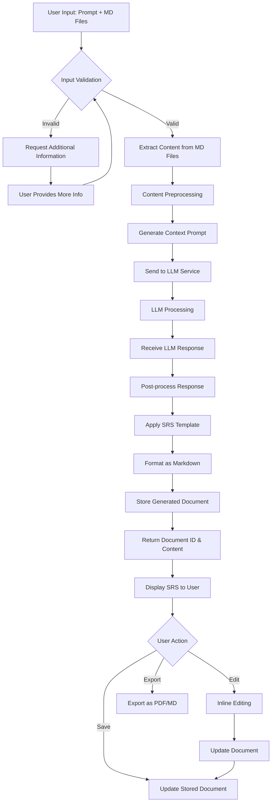
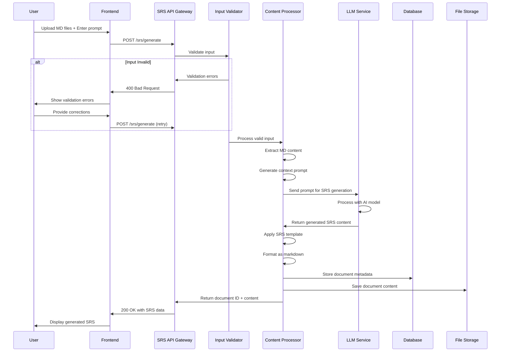
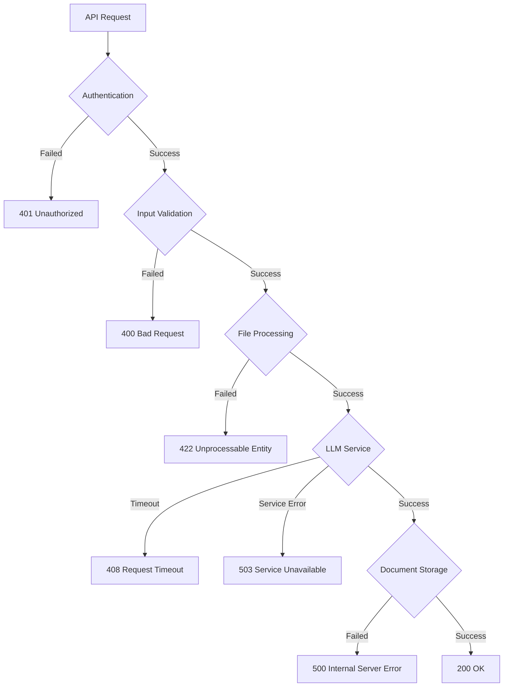
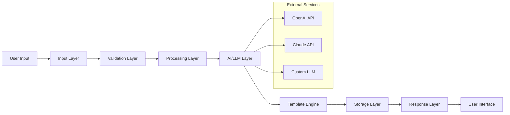

# SRS Generator Service Flow Diagram

## Overview

The SRS Generator service automates the creation of Software Requirements Specification documents based on user prompts and uploaded Markdown documents.

## Primary Flow Diagram

## Detailed Technical Flow

## Error Handling Flow

## Data Flow Architecture

