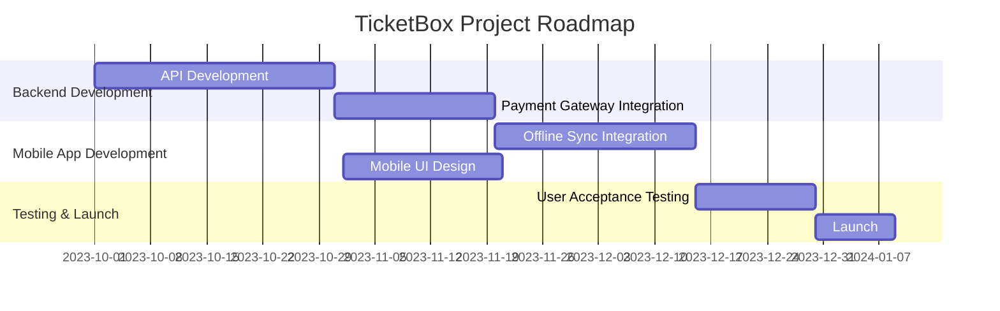

# Business Case Document: TicketBox Project

## Executive Summary
The TicketBox project aims to develop a high-concurrency event ticketing system that can handle massive load spikes while addressing critical issues such as website crashes, bot scalping, and missing tickets. This document outlines the core problems, in-scope features, and a product roadmap to ensure a successful rollout and integration of the TicketBox system.

## Problem Statement
### Core Problems
| Issue                | Description                                                                                       |
|----------------------|---------------------------------------------------------------------------------------------------|
| Website Crashes      | The current ticketing system is unable to handle peak traffic, resulting in website downtime.     |
| Bot Scalping         | Automated bots are purchasing tickets in bulk, leaving genuine users without access.              |
| Missing Tickets      | Users experience issues with ticket delivery, leading to confusion and dissatisfaction.            |

## Project Scope
### In-Scope Features
- **E-Ticketing:** A secure digital ticketing system to facilitate online purchases and distribution.
- **Admin Portal:** A comprehensive dashboard for managing events, users, and ticket sales.
- **Mobile Offline Check-In:** A feature to allow ticket validation in low-signal environments, ensuring smooth entry processes at venues.

## Dependencies and Constraints
- **Payment Gateways:** Integration with unstable payment gateways (VNPAY/MoMo) must be robust to prevent transaction failures.
- **User Limits:** Enforce strict ticket limits per user to combat scalping.
- **CSV Synchronization:** One-way synchronization of VIP lists must be implemented to ensure accurate access control.

## Product Roadmap
### Gantt Chart

## Conclusion
The TicketBox project is positioned to address significant challenges in the event ticketing industry by creating a reliable, user-friendly platform. By adhering to the outlined roadmap and integrating the necessary features, TicketBox aims to enhance user experience and maximize ticket sales while minimizing fraudulent activities.