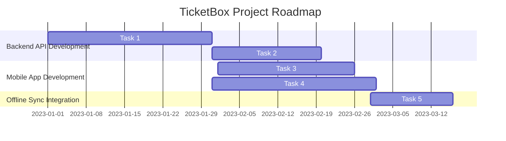

# High-Level Requirements Document for TicketBox Project

## 1. Introduction
The TicketBox project is designed to provide a high-concurrency event ticketing system capable of handling significant user loads while ensuring a smooth purchasing experience. This document outlines the high-level requirements, including functional and non-functional aspects, stakeholder needs, and constraints relevant to the project.

## 2. Business Case & Scope Statement
### 2.1 Core Problems
- **Website Crashes**: The system must handle high traffic without downtime.
- **Bot Scalping**: Mechanisms to prevent automated ticket purchases.
- **Missing Tickets**: Ensuring ticket purchases are accurately processed and recorded.

### 2.2 In-Scope Features
- **E-Ticketing**: Digital ticket sales and distribution.
- **Admin Portal**: Administrative interface for managing events and ticket sales.
- **Mobile Offline Check-In**: Allowing ticket validation without a stable internet connection in stadium areas.

## 3. Functional Requirements
### 3.1 E-Ticketing Features
| Requirement ID | Description |
|----------------|-------------|
| FR-001 | Users must be able to create an account to purchase tickets. |
| FR-002 | Users can search for events and view ticket availability. |
| FR-003 | Users can purchase tickets with a limit of X per transaction. |
| FR-004 | The system sends e-tickets via email upon successful payment. |

### 3.2 Admin Portal Features
| Requirement ID | Description |
|----------------|-------------|
| FR-005 | Admins must be able to create and manage events. |
| FR-006 | Admins can view sales analytics and ticket inventory. |
| FR-007 | Admins can validate tickets using a mobile app. |

### 3.3 Mobile Offline Check-In Features
| Requirement ID | Description |
|----------------|-------------|
| FR-008 | The mobile app must allow ticket scanning offline. |
| FR-009 | The app must sync ticket validation data once online. |

## 4. Non-Functional Requirements
| Requirement ID | Description |
|----------------|-------------|
| NFR-001 | The system must support a minimum of 80,000 concurrent users. |
| NFR-002 | The system response time must be under 2 seconds for ticket purchases. |
| NFR-003 | Payment gateways must have a 99.5% uptime. |
| NFR-004 | The mobile app must have an availability of 99.9%. |

## 5. Stakeholder Needs
- **Event Organizers**: Require reliable ticket sales and data access.
- **Users**: Demand a seamless purchasing experience and secure transactions.
- **Administrators**: Need intuitive tools for event management and data analysis.

## 6. Constraints, Assumptions, Dependencies
### 6.1 Constraints
- Payment gateway reliability (VNPAY/MoMo).
- Limited internet connectivity in certain stadium areas.

### 6.2 Assumptions
- Users have access to a smartphone or computer for ticket purchases.
- Admins will be trained to use the portal effectively.

### 6.3 Dependencies
- Integration with payment gateways must be completed before launch.
- Mobile app development must be synchronized with backend API availability.

## 7. Acceptance Criteria
| Requirement ID | Acceptance Criteria |
|----------------|---------------------|
| FR-001 | User can successfully create an account and log in. |
| FR-002 | Users can find events by location and date. |
| FR-003 | System prevents users from exceeding ticket limits. |
| FR-004 | E-tickets are received via email within 5 minutes of purchase. |
| FR-005 | Admin can create a new event in less than 5 minutes. |
| FR-008 | Offline ticket scanning works without internet connection. |

## 8. Product Roadmap
