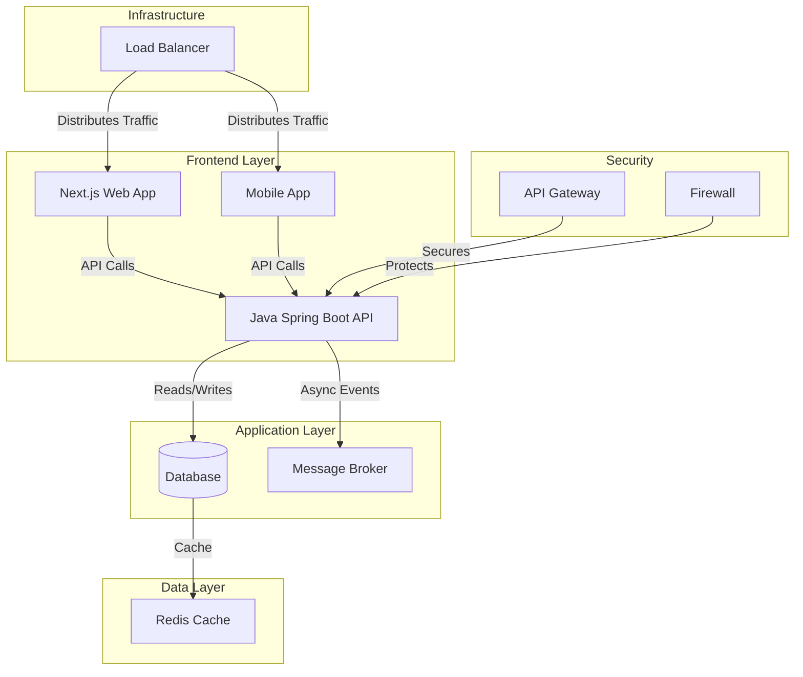
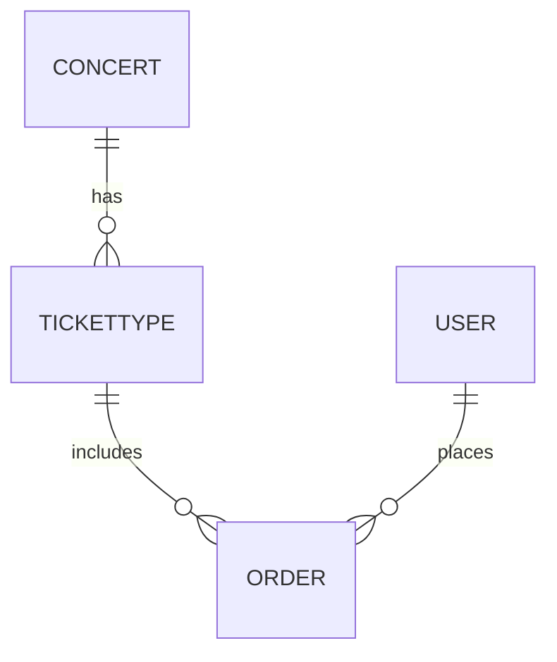

# TicketBox Project Documentation

## High-Level System Architecture Diagram

### System Components
- **Frontend:** Next.js web app, Mobile app
- **Backend:** Java Spring Boot API
- **Database:** Relational Database (e.g., PostgreSQL)
- **Services:** Payment Gateways (VNPAY, MoMo), Message Broker (e.g., Kafka)

### External Systems
- Payment Gateway APIs
- Ticket validation service

### Data Flow
- User requests processed through frontend
- API calls to backend services
- Database interactions for persistent data
- Message broker for asynchronous processing

### Layers
- **Presentation Layer:** Next.js web app, Mobile app
- **Application Layer:** Java Spring Boot API
- **Data Layer:** Database, Redis cache

### Infrastructure
- **Load Balancer:** Distributes incoming traffic
- **Cache:** Redis for frequently accessed data
- **Queues:** Message broker for decoupled services

### Security Boundaries
- **Authentication:** OAuth2, JWT tokens
- **API Gateway:** Entry point for all requests
- **Firewall:** Protects backend services

## Low-Level Design

### Entity-Relationship Diagram (ERD)
- **Concert**: ID, Name, Date, Venue
- **TicketType**: ID, ConcertID, Type, Price, Quantity
- **Order**: ID, UserID, TicketTypeID, Quantity, OrderStatus
- **User**: ID, Name, Email, Phone

### Idempotency Key Mechanism
- **Key Generation:** Unique key per transaction request
- **Storage:** Temporary storage in Redis
- **Expiration:** Configured expiration time to prevent stale keys

## Infrastructure & Deployment
- **Containerization:** Docker for all services
- **Load Balancing:** Implemented with Nginx or HAProxy
- **Circuit Breaker Patterns:**
    - **Closed:** Normal operation
    - **Open:** Fail fast and route to fallback
    - **Half-Open:** Allow limited traffic after timeout

## UI/UX & RTM
### Interactive SVG Seating Chart
- Template layout for dynamic seat selection

### Requirements Traceability Matrix (RTM)
- High-load protection requirements mapped to LLD specifications
- Each requirement linked to specific database entities and service components
