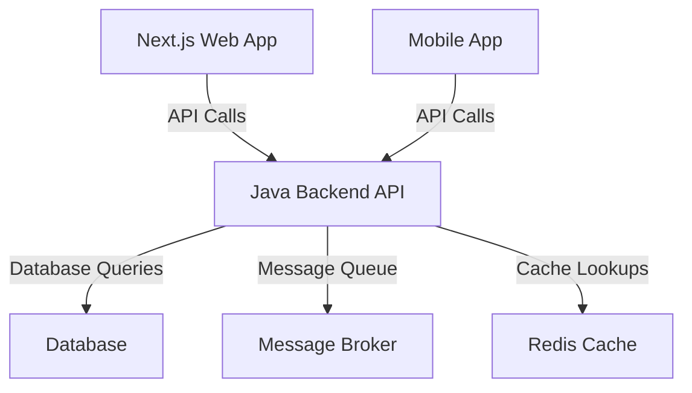
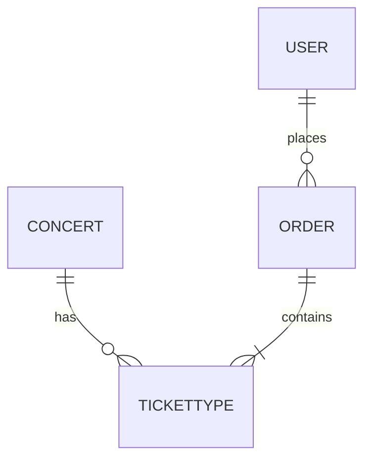

# TicketBox Project Specification Documentation

## Introduction
The TicketBox project aims to develop a high-concurrency event ticketing system capable of handling massive load spikes, while ensuring secure and efficient ticket purchasing and validation processes.

## High-Level Design (HLD)
### Backend Architecture
The backend architecture will rely on a Java and Spring Boot ecosystem to manage the ticketing system's core functionalities. The architecture will include:
- **Java Spring Boot Application**: Handles business logic and API endpoints.
- **Database**: A relational database (e.g., PostgreSQL) for storing ticketing data.
- **Message Broker**: For managing asynchronous tasks and communication (e.g., RabbitMQ).
- **Redis Cache**: An in-memory data structure store for caching high-traffic data such as concert listings.

### C4 Level 2 Container Diagram

## Low-Level Design (LLD)
### Entity-Relationship Diagram (ERD)
The core ticketing models consist of the following entities:
- **Concert**: Represents the event details.
- **TicketType**: Defines the different types of tickets available.
- **Order**: Contains details about user purchases.
- **User**: Represents the customers who buy tickets.

### Idempotency Key Mechanism
To prevent double-charging during payment processing, the following idempotency key mechanism will be implemented:
- **Key Generation**: A unique key will be generated for each transaction request.
- **Storage**: The key will be stored in the database with the transaction status.
- **Expiration**: Keys will expire after a specified duration to avoid stale entries.

## Infrastructure & Deployment
### Docker Containerization Strategies
The application components will be containerized using Docker to ensure consistent deployment across environments. Each service (backend API, database, etc.) will run in its own container.

### Load Balancing
A load balancer (e.g., AWS ELB) will be configured to distribute incoming traffic evenly across multiple backend instances, providing scalability during traffic spikes.

### Circuit Breaker Patterns
To handle unstable payment gateways, a circuit breaker pattern will be implemented:
- **Closed**: Normal operation, all requests are allowed.
- **Open**: Requests are blocked for a specified time after detecting failures.
- **Half-Open**: Allows a limited number of requests to test if the issue has been resolved.

## UI/UX & RTM
### Interactive SVG Seating Chart Layout
The SVG seating chart will be structured to allow for real-time interaction and visualization of available seats. It will include:
- **Seat Availability**: Color-coded seats based on availability.
- **User Interaction**: Clickable seats to select or reserve.

### Requirements Traceability Matrix (RTM)
The RTM will link high-load protection requirements to the LLD specifications, ensuring all requirements are addressed:
| Requirement ID | Description                              | LLD Reference |
|----------------|------------------------------------------|---------------|
| REQ-001       | Handle 80,000 concurrent users           | ERD, API Design|
| REQ-002       | Implement idempotency for payments       | Idempotency Key Mechanism|
| REQ-003       | Ensure offline ticket validation          | C4 Diagram, Docker Strategy|

## Conclusion
This document outlines the robust architecture and design specifications needed for the TicketBox project, ensuring a scalable, secure, and cost-optimized ticketing solution that meets all outlined requirements.