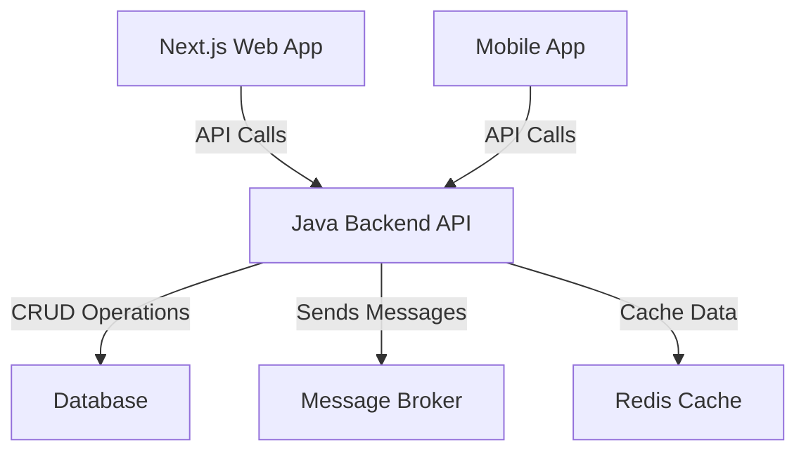
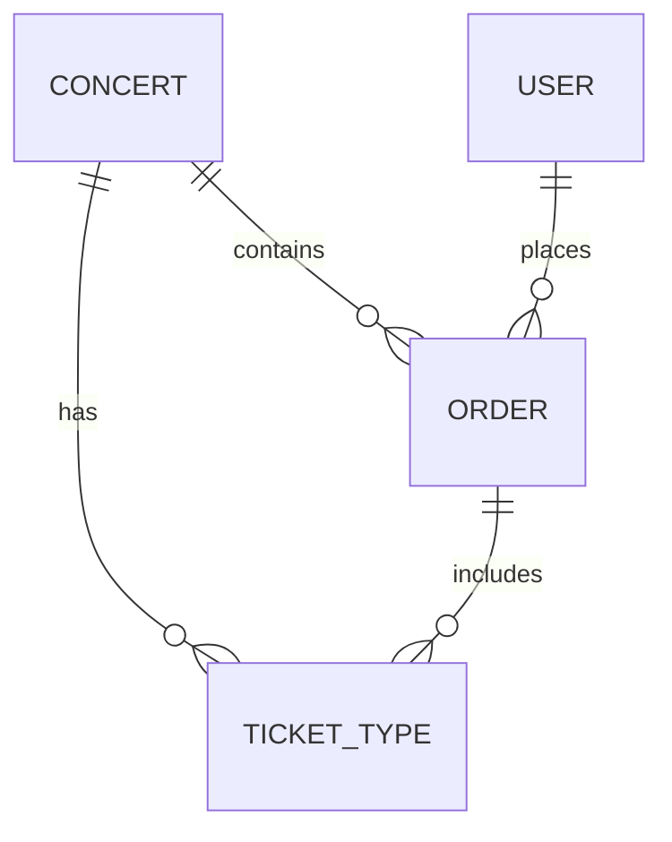

# Technology Stack Selection Document

## Project Overview
- **Project Name:** TicketBox
- **Description:** High-concurrency event ticketing system for managing ticket sales with strict user limits.
- **Key Challenges:** 80,000 users in first 5 minutes, unstable payment gateways, offline ticket inspection, and synchronization of VIP lists.

## High-Level Design (HLD)
- **Backend Architecture:** 
  - **Ecosystem:** Java and Spring Boot
  - **Components:** 
    - Next.js web app
    - Mobile app
    - Java backend API
    - Database
    - Message broker
    - Redis cache for concert listing pages

### C4 Level 2 Container Diagram

## Low-Level Design (LLD)
### Entity-Relationship Diagram (ERD)

### Idempotency Key Mechanism
- **Key Generation:** Unique identifier for each transaction
- **Storage:** Persisted in a temporary store (e.g., Redis)
- **Expiration:** Set TTL to invalidate keys after successful transactions

## Infrastructure & Deployment
- **Containerization:** Use Docker for microservices
- **Load Balancing:** Implement strategies for sudden traffic spikes (e.g., NGINX, HAProxy)
- **Circuit Breaker Patterns:** 
  - **Closed:** Normal operation
  - **Open:** Stop requests to failing service
  - **Half-Open:** Allow limited requests to check service recovery

## UI/UX & RTM
### Interactive SVG Seating Chart
- **Template Layout Structure:**
  - Dynamic seat selection
  - Visual feedback for availability
  - Integration with backend for real-time updates

### Requirements Traceability Matrix (RTM)
| Requirement ID | Description | Linked LLD Spec |
|----------------|-------------|------------------|
| REQ-001        | Handle 80,000 users | Load Balancer |
| REQ-002        | User ticket limits    | Idempotency Key |
| REQ-003        | Payment Gateway stability | Circuit Breaker |
| REQ-004        | Offline ticket inspection | Mobile App |
| REQ-005        | VIP list synchronization | Message Broker |