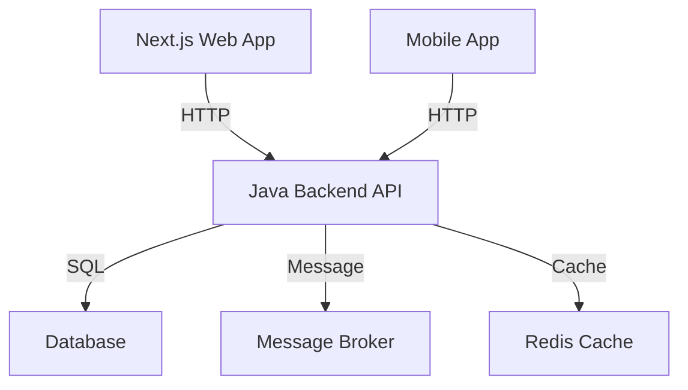

# TicketBox API Specification Documentation

## High-Level Design (HLD)

### Backend Architecture
The TicketBox system is designed to handle high concurrency, ensuring seamless ticket purchasing experience during peak loads. The architecture relies on a Java and Spring Boot ecosystem that includes the following components:
- **Next.js Web App**: Frontend interface for users to browse and purchase tickets.
- **Mobile App**: Provides users with access to ticket purchasing and management on mobile devices.
- **Java Backend API**: Services business logic and data handling for ticket transactions.
- **Database**: Stores user, ticket, and event information.
- **Message Broker**: Facilitates asynchronous communication between services, ensuring high availability.
- **Redis Cache**: Used for caching concert listings to handle high traffic efficiently.

### C4 Level 2 Container Diagram


## Low-Level Design (LLD)

### Entity-Relationship Diagram (ERD)
The core models of the TicketBox system are represented in the following ERD:
```mermaid
classDiagram;
    class Concert {
        +String concertId
        +String name
        +DateTime date
        +String location
    }
    class TicketType {
        +String typeId
        +String description
        +Decimal price
        +Integer limit
    }
    class Order {
        +String orderId
        +String userId
        +List<Ticket> tickets
        +String status
    }
    class User {
        +String userId
        +String name
        +String email
        +String phone
    }
    Concert --> TicketType
    User --> Order
    Order --> TicketType;
```

### Idempotency Key Mechanism
To avoid double-charging, an idempotency key mechanism is implemented as follows:
1. **Key Generation**: A unique key is generated for each transaction request by the client.
2. **Storage**: The key is stored in a Redis cache along with the transaction status and timestamp.
3. **Expiration**: Keys are set to expire after a configurable duration (e.g., 15 minutes) to prevent storage overflow.

## Infrastructure & Deployment

### Docker Containerization Strategies
Each component of the TicketBox system is containerized using Docker to ensure isolated environments and scalability.  The following services are containerized:
- Web App Container
- Mobile App Container
- Backend API Container
- Database Container
- Message Broker Container

### Load Balancing
To manage sudden traffic spikes, load balancing strategies such as NGINX or AWS Elastic Load Balancing are employed to distribute incoming traffic across multiple backend instances.

### Circuit Breaker Patterns
To handle unstable payment gateways, a circuit breaker pattern is implemented:
- **Closed**: Normal operation, requests are allowed.
- **Open**: Requests are rejected when failures exceed a threshold.
- **Half-Open**: A limited number of requests are allowed to check if the issue has been resolved.

## UI/UX & RTM

### Interactive SVG Seating Chart Layout
The seating chart will be designed using SVG for interactive visualizations. The structure includes:
- **Seat Blocks**: Representing individual seats with states (available, booked, VIP).
- **Sections**: Grouping seats into sections with labels and pricing.
- **User Interaction**: Clickable seats for selection and real-time updates.

### Requirements Traceability Matrix (RTM)
The following matrix links high-load protection requirements to LLD specifications:

| Requirement ID | Requirement Description           | LLD Specification                       |
|----------------|-----------------------------------|----------------------------------------|
| HL-001         | Handle 80,000 users in 5 minutes | Load balancing & Redis caching         |
| HL-002         | Prevent double-charging           | Idempotency key mechanism              |
| HL-003         | Support offline ticket inspection  | Mobile app functionality               |
| HL-004         | Sync VIP CSV lists                | Asynchronous message broker integration |
