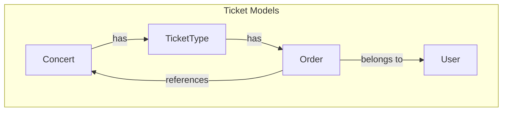

# TicketBox Project Specification Documentation

## HLD (High-Level Design)
### Backend Architecture
The backend architecture for the TicketBox project is designed to handle high concurrency using a Java and Spring Boot ecosystem. The following C4 Level 2 Container diagram illustrates the components involved.

```mermaid
graph TB
    subgraph Web Applications
        A[Next.js Web App] -->|Uses| B[Java Backend API]
        C[Mobile App] -->|Uses| B
    end
    subgraph Backend Services
        B -->|Reads/Writes| D[(Database)]
        B -->|Uses| E[Message Broker]
        B -->|Caches| F[Redis Cache]
    end
    subgraph External Services
        G[VNPAY] -->|Integrates| B
        H[MoMo] -->|Integrates| B
    end
    A -->>|User Interaction| C
    D -->>|Stores| C
    E -->>|Handles Events| B
    F -->>|Caches Concert Listings| B
```  

## LLD (Low-Level Design)
### Entity-Relationship Diagram (ERD)
The core ticketing models are represented in the following ERD:



### Idempotency Key Mechanism
- **Key Generation:** Generate a unique key for each transaction request.
- **Storage:** Store the key in a temporary Redis cache with a TTL (Time-To-Live).
- **Expiration:** Automatically expire keys after a specified time to prevent stale entries from causing issues.

## Infrastructure & Deployment
### Docker Containerization Strategies
- Use Docker to containerize the Java backend API, database, and caching layers.
- Ensure each service container can scale independently based on load.

### Load Balancing
- Implement a load balancer to distribute incoming traffic across multiple backend instances during sudden spikes in user activity.

### Circuit Breaker Patterns
- Implement circuit breaker patterns (Closed/Open/Half-Open) for payment integration services (VNPAY and MoMo) to prevent failures from propagating in case of service unavailability.

## UI/UX & RTM
### Interactive SVG Seating Chart Structure
- The interactive seating chart will be structured to allow users to view available seats dynamically.

### Requirements Traceability Matrix (RTM)
| Requirement ID | Description | LLD Specification |
|----------------|-------------|------------------|
| REQ-001 | Handle 80,000 concurrent users | Load balancing, caching  |
| REQ-002 | Per-user ticket limits | TicketType model |
| REQ-003 | Payment gateway stability | Circuit breaker pattern |
| REQ-004 | Offline ticket inspection | User model, Order model |
| REQ-005 | VIP CSV synchronization | Concert model |
