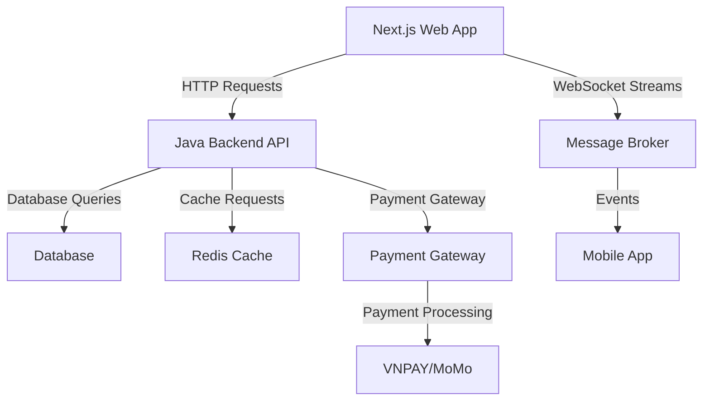
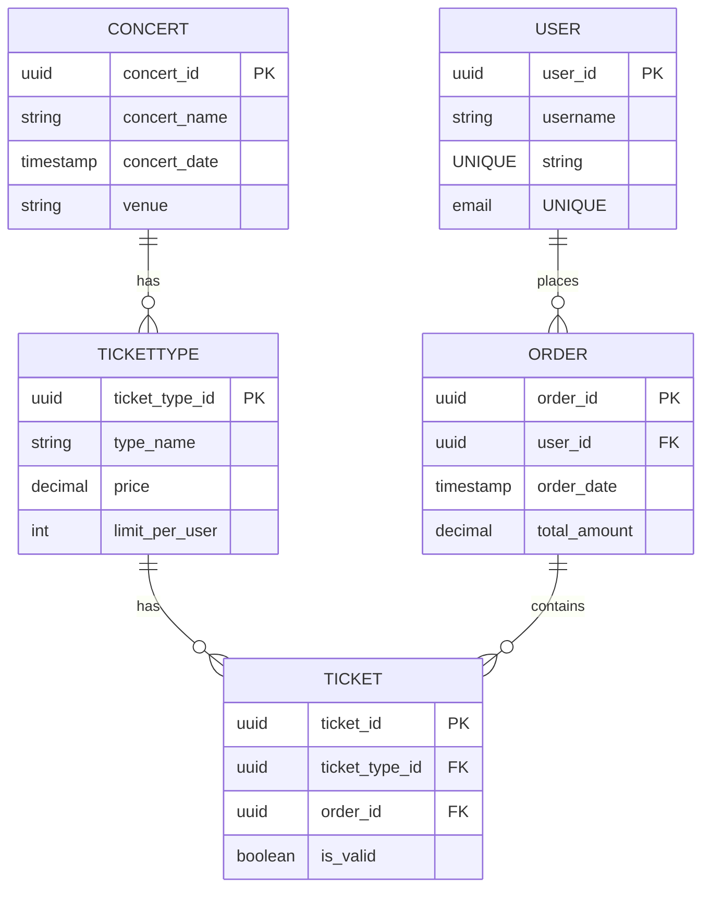

# TicketBox Project Documentation

## High-Level Design (HLD)
### Backend Architecture
The TicketBox project will utilize a Java and Spring Boot ecosystem to handle high concurrency and massive load spikes. The following C4 Level 2 Container diagram illustrates the architecture:

## Low-Level Design (LLD)
### Entity-Relationship Diagram (ERD)
The following ERD represents the core ticketing models for the TicketBox system:

### Idempotency Key Mechanism
To prevent double-charging, the idempotency key mechanism will be implemented as follows:
1. **Key Generation**: A unique idempotency key is generated for each transaction request.
2. **Storage**: The key is stored in the database associated with the transaction details.
3. **Expiration**: The key will expire after a specified duration to allow for retries of subsequent transactions.

## Infrastructure & Deployment
### Docker Containerization Strategies
- Each service will be containerized for isolated deployment.
- Use Docker Compose for local development and testing.

### Load Balancing
- Implement load balancers (e.g., NGINX) to handle sudden traffic spikes effectively.

### Circuit Breaker Patterns
- Use circuit breaker patterns (Closed/Open/Half-Open) for payment integrations to ensure system resilience during payment gateway failures.

## UI/UX & RTM
### Interactive SVG Seating Chart
Template layout structures for the interactive SVG seating chart will be generated to enhance user experience.

### Requirements Traceability Matrix
The following matrix links high-load protection requirements to the LLD specifications:
| Requirement ID | Description                     | Linked LLD Specification |
|-----------------|---------------------------------|--------------------------|
| HL-001          | Support for 80,000 users       | Load Balancing           |
| HL-002          | Idempotency for payments        | Idempotency Key Mechanism|
| HL-003          | Offline mobile ticket inspection | User and Ticket Models   |