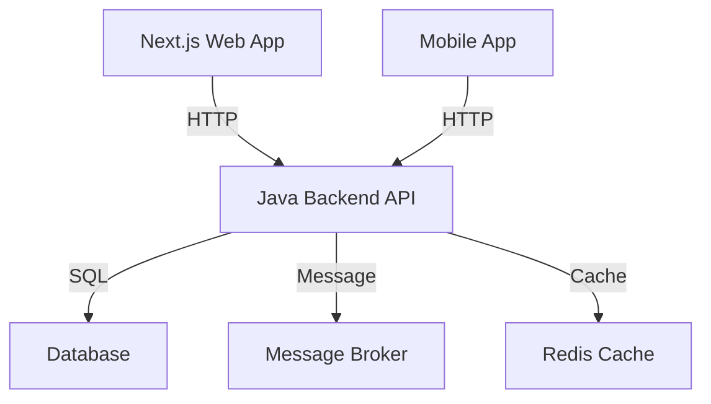
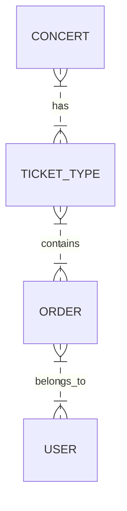

# TicketBox Project Specification

## Project Context
- **TicketBox**: A high-concurrency event ticketing system.
- Handles massive load spikes (e.g., 80,000 users in the first 5 minutes).
- Manages strict per-user ticket limits.
- Engages unstable payment gateways (VNPAY/MoMo).
- Supports offline mobile ticket inspection in weak-signal stadium areas.
- Facilitates one-way VIP CSV list synchronization.

## HLD (High-Level Design)
### Backend Architecture Proposal
- **Technology Stack**: Java, Spring Boot.
- **Components**:
  - Next.js web application.
  - Mobile application.
  - Java backend API.
  - Database (e.g., PostgreSQL).
  - Message Broker (e.g., RabbitMQ).
  - Redis cache for concert listings.

### C4 Level 2 Container Diagram

## LLD (Low-Level Design)
### Entity-Relationship Diagram (ERD)

### Idempotency Key Mechanism
1. **Key Generation**:
   - Generate unique keys using UUID.
2. **Storage**:
   - Store keys in Redis with user ID as a reference.
3. **Expiration**:
   - Set expiration time to 30 minutes to prevent stale keys.

## Infrastructure & Deployment
- **Docker Containerization**: 
  - Create separate containers for services (API, DB, Cache).
- **Load Balancing**: 
  - Use Nginx or HAProxy for distributing traffic.
- **Circuit Breaker Patterns**: 
  - **Closed**: Normal operation.
  - **Open**: Failures trigger circuit to open.
  - **Half-Open**: Allow a limited number of requests to test recovery.

## UI/UX & RTM
### Interactive SVG Seating Chart Layout Structure
- **Components**:
  - Seat blocks (available, sold, reserved).
  - Interactive hover effects for seat information.
- **Data Binding**: Ensure real-time updates on seat status.

### Requirements Traceability Matrix
| Requirement ID | Description                            | LLD Specification ID |
|----------------|----------------------------------------|----------------------|
| REQ-001        | High-load protection                   | ERD-001              |
| REQ-002        | Idempotency key for payments           | ID-001               |
| REQ-003        | Offline ticket inspection               | LLD-002              |
| REQ-004        | One-way CSV synchronization             | LLD-003              |
