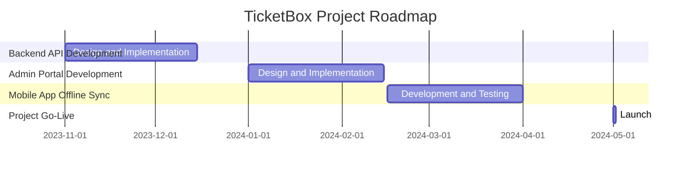

# Project Scope Statement

## Project Title
TicketBox Project

## Project Start Date
2023-11-01

## Project End Date
2024-05-01

## Project Purpose
To develop a high-concurrency event ticketing system that meets the challenges of massive load spikes and provides a seamless user experience.

## Business Case
- **Core Problems:**
  - Website crashes during high traffic events.
  - Bot scalping leading to unfair ticket distribution.
  - Missing tickets and payment failures during transactions.

- **Solution Overview:**
  - Implement e-ticketing with secure transactions.
  - Create an admin portal for real-time monitoring and control.
  - Develop a mobile offline check-in feature for event entry.

## Scope Definition
### In-Scope Features
- **E-Ticketing Module:**
  - User-friendly ticket purchasing interface.
  - Integration with VNPAY and MoMo payment gateways.
  - Strict per-user ticket limits to prevent scalping.

- **Admin Portal:**
  - Real-time analytics dashboard.
  - User management and ticket allocation control.
  - Incident reporting and troubleshooting tools.

- **Mobile Offline Check-in:**
  - Offline ticket validation in low-signal areas.
  - Synchronization of ticket data with the central server.

### Out-of-Scope Features
- External marketing tools.
- Third-party integrations not specified in the initial requirements.

## Project Deliverables
- Fully functional e-ticketing system.
- Admin portal with comprehensive management tools.
- Mobile application supporting offline check-in.

## Project Milestones
| Milestone                        | Date          |
|----------------------------------|---------------|
| Project Kick-off                 | 2023-11-01    |
| Completion of Backend API        | 2024-01-15    |
| Admin Portal Development         | 2024-02-15    |
| Mobile App Development           | 2024-03-15    |
| System Integration Testing       | 2024-04-01    |
| Project Go-Live                  | 2024-05-01    |

## Dependency Constraints
- Integration with existing payment gateways (VNPAY/MoMo).
- WebSocket implementation for real-time data streaming.
- Compliance with data protection regulations.

## Product Roadmap

## Conclusion
The TicketBox project aims to address critical issues in event ticketing and deliver a robust solution that ensures user satisfaction and operational efficiency.