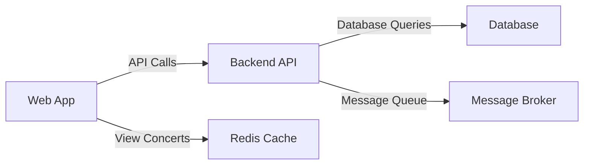
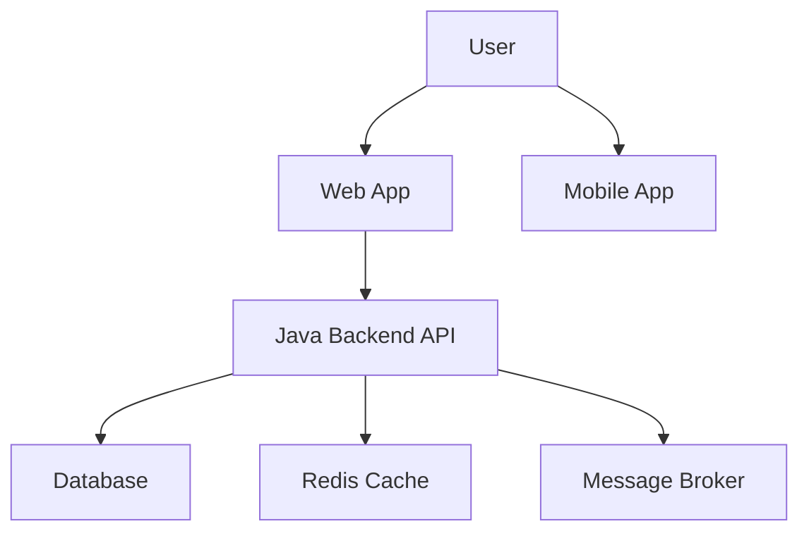

# TicketBox — Software Requirements Specification (SRS)

## 1. Introduction
### 1.1 Purpose
This Software Requirements Specification (SRS) document outlines the requirements for the TicketBox system, which aims to provide a high-concurrency event ticketing platform.

### 1.2 Scope
The scope of the TicketBox project includes:
- Viewing and purchasing tickets for concerts.
- Real-time ticket availability.
- Secure payment processing via VNPAY and MoMo.
- Offline ticket inspection capabilities.

### 1.3 Audience
This document is intended for stakeholders, including business analysts, developers, and testers.

### 1.4 Definitions
- **High Concurrency**: The ability to handle a large number of users simultaneously, specifically up to 80,000 users within the first five minutes of ticket sales.
- **Idempotency Key**: A mechanism to ensure that a transaction is processed exactly once, preventing double-charging.

## 2. Overall Description
### 2.1 Product Perspective
The TicketBox system will serve as a centralized platform for ticket sales and management. It will consist of:
- A web application for audiences to view and purchase tickets.
- A mobile application for ticket inspectors to verify tickets.
- A backend API developed using Java and Spring Boot.

### 2.2 Product Features
1. **View Concert Information**: Users can view concert details, including seating charts and ticket availability.
2. **Ticket Purchase**: Users can select ticket types, proceed to payment, and receive e-tickets.
3. **Ticket Inspection**: Inspectors can verify tickets offline and ensure no duplicate entries.
4. **CSV Import**: The system will support one-way CSV imports for VIP guest lists.

## 3. System Requirements
### 3.1 Functional Requirements
- **FR1**: The system shall allow users to view upcoming concerts.
- **FR2**: The system shall enable users to purchase tickets with a limit per user.
- **FR3**: The system shall send e-tickets in QR code format upon successful payment.
- **FR4**: The system shall allow ticket inspectors to verify tickets offline.

### 3.2 Non-Functional Requirements
- **NFR1**: The system shall support 80,000 concurrent users.
- **NFR2**: The system shall ensure data consistency during payment transactions.
- **NFR3**: The system shall provide a caching mechanism for frequently accessed concert information.

## 4. High-Level Design
### 4.1 Overall Architecture
The architecture of the TicketBox system is built around a microservices approach, utilizing a Java and Spring Boot ecosystem. The components will communicate via REST APIs.

### 4.2 C4 Diagram

### 4.3 High-Level Architecture Diagram


## 5. Low-Level Design
### 5.1 Entity-Relationship Diagram (ERD)
```mermaid
er Diagram
classDiagram
    class Concert {
        +id: int
        +name: string
        +date: Date
        +venue: string
    }
    class TicketType {
        +id: int
        +concertId: int
        +type: string
        +price: float
        +maxPerUser: int
    }
    class Order {
        +id: int
        +userId: int
        +ticketTypeId: int
        +quantity: int
        +status: string
    }
    class User {
        +id: int
        +name: string
        +email: string
    }
    Concert --> TicketType
    User --> Order
    TicketType --> Order
```

### 5.2 Idempotency Key Mechanism
The idempotency key will be generated using a unique identifier for each transaction. It will be stored in the database and checked against incoming requests to prevent double charges. Expiration time for keys will be set to 30 minutes to allow for retries without overloading the system.

## 6. Infrastructure & Deployment
### 6.1 Docker Containerization
The application components will be containerized using Docker for easy deployment and scalability.

### 6.2 Load Balancing
Load balancers will be implemented to distribute traffic evenly across multiple instances, ensuring that sudden spikes in traffic do not overwhelm the system.

### 6.3 Circuit Breaker Pattern
The circuit breaker pattern will be implemented for payment gateway integrations to handle unstable connections and prevent cascading failures.

## 7. UI/UX & RTM
### 7.1 Interactive SVG Seating Chart
The seating chart will be designed to allow users to select their seats visually, with immediate feedback on availability.

### 7.2 Requirements Traceability Matrix (RTM)
| Requirement ID | Description | Related Feature |
|----------------|-------------|-----------------|
| NFR1           | Support 80,000 concurrent users | System Performance |
| FR3            | Send e-tickets upon payment | Ticket Purchase |
| FR4            | Offline ticket inspection | Ticket Inspection |

---