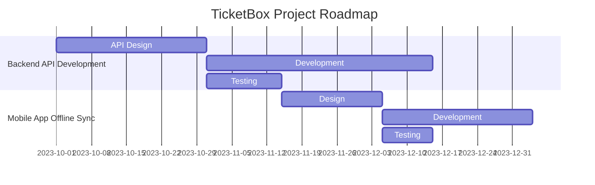

# Stakeholder Register for TicketBox Project

## Introduction
The Stakeholder Register is crucial for identifying and managing the stakeholders involved in the TicketBox project, which aims to create a high-concurrency event ticketing system. This document outlines the key stakeholders, their interests, influence, and engagement strategies.

## Stakeholder Overview
| Stakeholder Name | Role/Title           | Interest Level | Influence Level | Engagement Strategy           |
|-------------------|---------------------|----------------|-----------------|-------------------------------|
| Project Sponsor    | Chief Technology Officer | High           | High            | Regular updates, strategic meetings |
| Project Manager    | Project Manager      | High           | Medium          | Weekly status reports, daily stand-ups |
| Development Team   | Software Engineers    | Medium         | Medium          | Agile ceremonies, collaborative tools |
| Marketing Team     | Marketing Director    | High           | Low             | Monthly reviews, feedback sessions |
| Operations Team    | Operations Manager    | Medium         | Medium          | Bi-weekly meetings, operational reviews |
| End Users          | Event Attendees       | High           | Low             | User surveys, feedback forms |
| Payment Gateway    | VNPAY/MoMo Partner    | Medium         | High            | Contractual agreements, performance reviews |
| Regulatory Body    | Compliance Officer     | Low            | High            | Compliance checks, regular reports |

## Stakeholder Analysis
- **Project Sponsor**: The Chief Technology Officer is highly invested in the success of the TicketBox project due to its potential to enhance the company’s market position.
- **Project Manager**: Responsible for the day-to-day management and execution of project tasks, ensuring alignment with business objectives.
- **Development Team**: Focused on building a robust, scalable solution to handle the expected load spikes and ensuring the system's reliability.
- **Marketing Team**: Will play a critical role in the promotion of the TicketBox platform and managing customer expectations.
- **Operations Team**: Responsible for the operational aspects of ticketing during events, including ticket inspection and customer support.
- **End Users**: The primary beneficiaries of the system, their feedback will be essential in shaping the product to meet user needs.
- **Payment Gateway**: Will require close collaboration to ensure seamless transaction processing and handling of potential issues during peak loads.
- **Regulatory Body**: Requires compliance with industry standards and regulations, necessitating regular updates and reports.

## Communication Plan
- **Frequency**: Different stakeholders will have varying frequencies of communication based on their influence and interest levels.
- **Methods**: Various methods will be employed including emails, reports, meetings, and surveys to ensure all stakeholders are adequately informed and engaged.

## Conclusion
This Stakeholder Register is a living document and will be updated as the project progresses. Engaging with stakeholders effectively is crucial to the success of the TicketBox project, ensuring that their needs and concerns are addressed promptly.

## Appendices
### Gantt Chart
